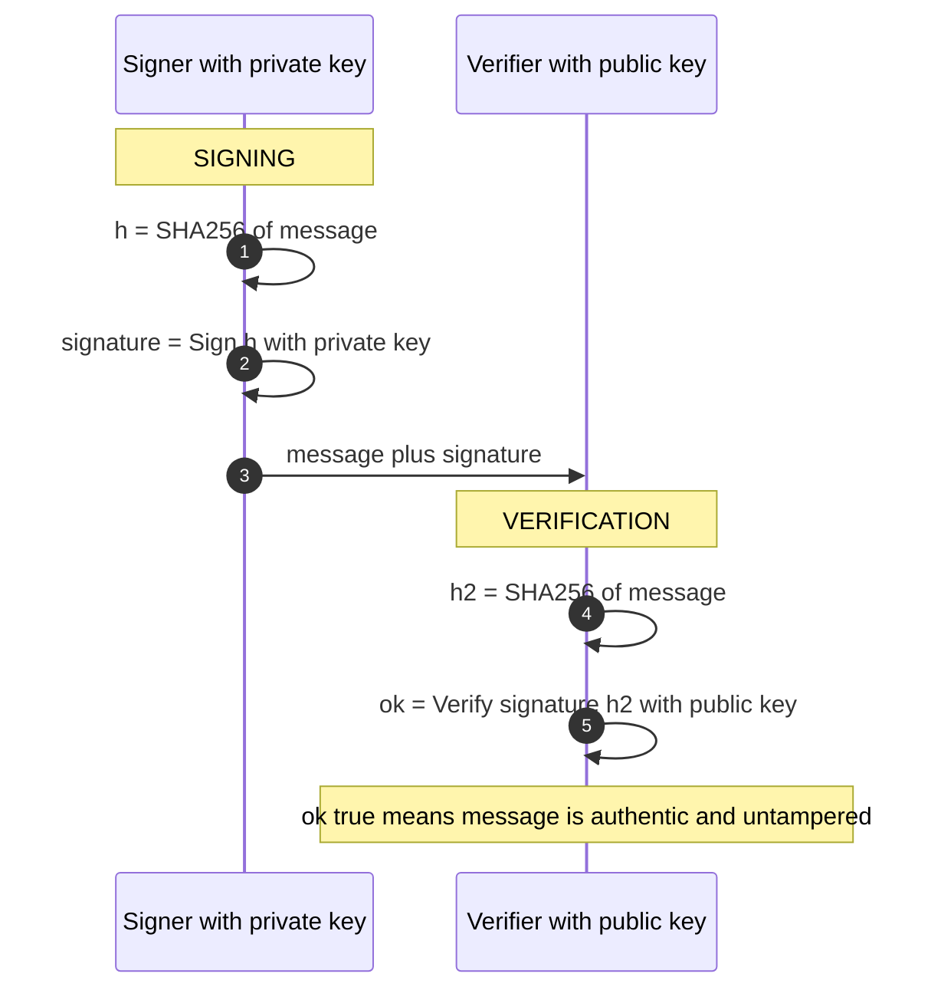

*This is the starting primitive — nothing else is required first.*

## The mental model

Digital signing is the atomic primitive that everything else in this guide rests on. A keypair has two halves: a **private key** kept secret by the signer, and a **public key** shared with everyone. The math is asymmetric — what one half does, only the other half can undo.

To sign: hash the message, run a **private-key signing operation** over that hash, and attach the result. To verify: hash the message yourself, then run the **public-key verify operation** over the message hash and the signature — it returns valid or invalid.

What this gives you:

- **Authenticity** — only the private key holder could have produced this signature
- **Integrity** — if the message changed, the hashes won't match
- **Non-repudiation** — *given* a trusted key-to-identity binding (PKI, §2) and evidence the key wasn't compromised at signing time (usually a trusted timestamp or transparency log, §7.4), the signer can't later deny signing. A bare signature from an anonymous key proves possession, not identity.

Textbook vs. reality

<strong>You may have learned:</strong> "signing = encrypt the hash with the private key; verifying = decrypt the signature with the public key."

<strong>What actually happens:</strong> only legacy <em>textbook RSA</em> looks like that. ECDSA, EdDSA, and RSA-PSS run a verification <em>equation</em> that outputs valid/invalid — nothing is "decrypted" and no hash is "recovered." The intuition that survives is: the private key produces a signature that only the matching public key can check.

## The sequence

## Walkthrough

**1–2.** The signer hashes the message to a fixed-length digest. Hashing first lets you sign any size of data with a small cryptographic operation, and it's where collision resistance becomes important — if two different messages produce the same hash, the signature is ambiguous about which one was signed.

**3.** The signer runs the signing operation over the hash with their private key, producing the signature. (As the box above notes, "encrypt with the private key" is only a loose analogy for legacy RSA — modern schemes perform algorithm-specific operations, but the intuition "private key turns hash into signature" holds.)

**4.** The message and signature travel together. The signature alone tells you nothing; the signature plus the message lets a verifier check the binding.

**5–7.** The verifier independently hashes the message, then runs the verification algorithm with the public key, the message hash, and the signature. It outputs valid or invalid. (Only textbook RSA literally "recovers" a hash to compare; ECDSA/EdDSA/RSA-PSS just check an equation.) A valid result means the message is authentic and unmodified.

## Modern algorithms

You'll see these in the wild:

- **RSA-PSS** — legacy but ubiquitous. Large keys, large signatures, well understood.
- **ECDSA** — smaller signatures, faster operations, more failure modes (random nonce reuse breaks it entirely).
- **EdDSA / Ed25519** — newer, deterministic signatures, no random nonce needed, simpler implementation.
- **ML-DSA / Dilithium** — NIST-standardized post-quantum signature scheme, much larger keys and signatures but resistant to quantum attacks.

ECDSA nonce reuse

If you ever sign two different messages with the same ECDSA nonce, the math leaks your private key — the failure that broke Sony's PlayStation 3 firmware signing (see §1.4 TRNG for that and other RNG disasters). Always use a fresh, cryptographically random nonce per signature, or deterministic ECDSA (RFC 6979), which derives the nonce from the message hash and private key.

Takeaway

Signing proves three things at once — that the signer holds the private key, that the message is the one signed, and that the message hasn't changed. The whole edifice of cryptographic trust is recursive application of this primitive.

