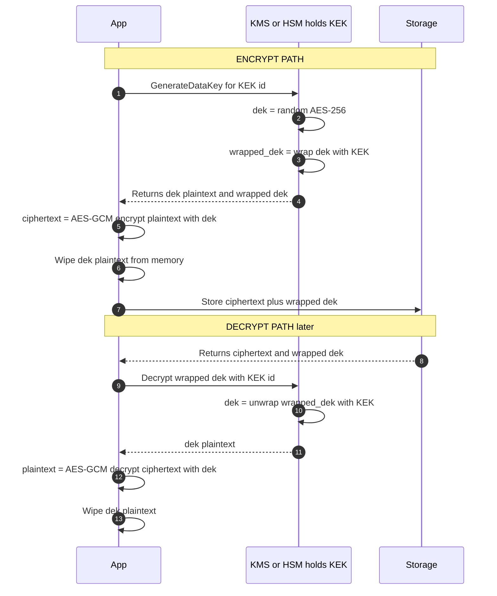

*Builds on: §1.1 Signing & verification.*

## The mental model

Real cryptographic systems never use a single key for everything. They use a **layered hierarchy** where keys at higher levels protect keys at lower levels. The standard pattern has three layers:

- **Master Key (MK)** — lives inside the HSM, never leaves in plaintext. Used to wrap KEKs.
- **Key-Encrypting Key (KEK)** — wraps DEKs. One KEK per tenant, application, or region.
- **Data Encryption Key (DEK)** — actually encrypts user data. Cheap, frequently rotated, stored encrypted next to the data it protects.

The insight: **when you encrypt 1TB of data, you don't call the HSM a billion times.** You generate a DEK locally, encrypt the bulk data with the DEK, then ask the HSM to wrap the DEK with a KEK. The HSM does one operation; the bulk crypto happens in software. This is what "envelope encryption" means — the data is in an envelope sealed by the DEK, and the DEK is in a smaller envelope sealed by the KEK.

## The flow

## Walkthrough

**Encrypt path:**

**1.** The application asks the KMS for a fresh data key. Note: the application sends NO plaintext — just a reference to which KEK should protect the new DEK.

**2–3.** The KMS generates a random AES-256 key (the DEK) and uses the KEK to wrap (encrypt) the DEK. The KEK never leaves the KMS; only the wrapped DEK and a temporary plaintext copy of the DEK return.

**4.** The KMS returns both: the plaintext DEK (for the app to use right now) and the wrapped DEK (for the app to store).

**5–7.** The application encrypts data with the plaintext DEK using a fast symmetric algorithm (AES-GCM), then immediately wipes the plaintext DEK from memory. The wrapped DEK is stored alongside the ciphertext.

**Decrypt path:**

**8–11.** The app pulls back the ciphertext and wrapped DEK, sends only the wrapped DEK to the KMS, gets the plaintext DEK back, decrypts the data, and wipes the DEK again.

## Key wrapping vs envelope encryption — the precise distinction

These two terms get conflated but they're slightly different:

- **Key wrapping** — a specific NIST construction (SP 800-38F, AES-KW) designed to encrypt key material. Used inside HSMs and PKCS#11 APIs. Deterministic, no IV needed — which is acceptable here precisely because you're wrapping high-entropy key material, not user data (you would *not* want deterministic encryption for ordinary data).
- **Envelope encryption** — the broader pattern of nested key layers. The "wrapping" of the DEK is typically AES-GCM in cloud KMS implementations, not AES-KW. Same conceptual pattern, different primitive.

Why this design wins

The HSM does one operation per object regardless of object size. A 1GB file and a 1KB file both require exactly one HSM call to encrypt and one to decrypt. The bulk crypto happens at memory speed in the application. This is the only way HSM-backed encryption scales.

One DEK is not forever

A DEK is scoped to one object or one bounded stream — not "generate once, encrypt everything forever." AES-GCM has a safe-usage limit per key: with random nonces the collision risk and security bound degrade after roughly 232 encryptions. Generate a fresh DEK per object, rotate before approaching the limit, or use a nonce-misuse-resistant mode (AES-GCM-SIV) for high-volume cases.

Takeaway

Never call the HSM in a tight loop. Generate a DEK once, do the bulk crypto in software, ask the HSM to wrap the DEK. The hierarchy exists for performance as much as security.

