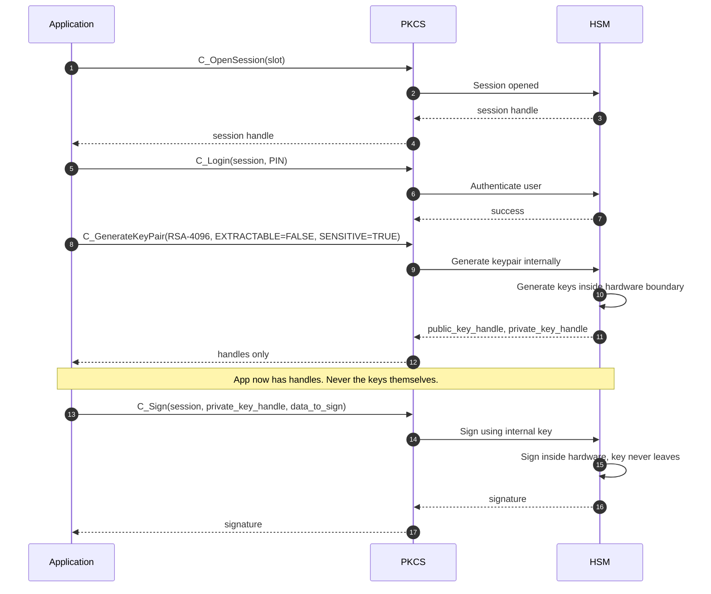

*Builds on: §1.2 Key hierarchy.*

## The mental model

PKCS#11 (also called *Cryptoki*) is the standard API between applications and hardware crypto devices. Created by RSA Security in the 1990s, it's now the universal language for talking to HSMs, smartcards, and YubiKeys. Understanding it is essential because **the design contract it imposes is what makes HSM-backed crypto trustworthy**.

The core idea: applications operate on **handles**, never on key values. The application says "sign this data with key handle 47" — and the actual key material never crosses the API boundary. This is the entire reason an HSM provides security beyond software crypto.

## The four core abstractions

- **Slot** — a logical container for a crypto device. Think USB port: the slot exists whether a device is plugged in or not.
- **Token** — the crypto device sitting in a slot. Has a label, a serial number, and a set of capabilities.
- **Session** — a stateful connection between an application and a token. Sessions can be read-only or read-write, user or Security Officer (SO).
- **Object** — anything stored in the token: keys, certificates, data. Each object has **attributes** that describe what it is and what it can do.

## Critical attributes to know

Keys in PKCS#11 have attributes that govern their behavior. The most important:

- `CKA_CLASS` — public key, private key, secret key, or certificate
- `CKA_TOKEN` — persistent (stored in token) or session-only
- `CKA_EXTRACTABLE` — can this key EVER leave the HSM in any form? Once set to FALSE, this is a one-way ratchet — the key is permanently bound to this token.
- `CKA_SENSITIVE` — when TRUE, the key's plaintext value can't be read back through the API. (It can still be exported in encrypted/*wrapped* form unless `CKA_EXTRACTABLE=FALSE` is also set — the two attributes do different jobs.)
- `CKA_SIGN`, `CKA_VERIFY`, `CKA_ENCRYPT`, `CKA_DECRYPT` — which operations the key can perform

## Key operations

You don't need to memorize the C API. You need to know what each function does:

| Function | Purpose |
| --- | --- |
| `C_GenerateKeyPair` | Create an asymmetric keypair inside the token. Private key never leaves. |
| `C_GenerateKey` | Create a symmetric key inside the token. |
| `C_Sign` | Sign data using a key handle. Application sends data plus handle, gets signature back. Never sees the key. |
| `C_Verify` | Verify a signature or MAC. For public-key signatures, often done in software instead. |
| `C_WrapKey` | Encrypt a key for export (using another key). How you back up keys. |
| `C_UnwrapKey` | Import a wrapped key. |
| `C_DeriveKey` | Derive a new key from an existing one. ECDH, KDF operations. |

The pattern is consistent: operations take handles, return results, never expose key material.

## The mental model in one image

## How this connects to higher layers

PKCS#11 is the low-level interface. Above it sit:

- **JCA/JCE** — Java Cryptography Architecture, bridges Java calls to PKCS#11
- **OpenSSL engines** — OpenSSL can use PKCS#11 as a crypto backend
- **KMIP** — Key Management Interoperability Protocol, often implemented atop PKCS#11
- **Cloud KMS APIs** — AWS KMS, Azure Key Vault, GCP Cloud KMS abstract PKCS#11 entirely, but their cloud HSMs speak PKCS#11 underneath

The core insight

Once you internalize 'operations on handles, not values,' you understand the entire field. Every secure cryptographic system uses this pattern at some boundary — HSMs, TPMs, secure enclaves, smartcards. The application never possesses the key; it asks a trusted thing to operate on its behalf.

Takeaway

PKCS#11 is the API contract that makes hardware-backed cryptography possible. Applications work with handles; the HSM works with values. The trust boundary lives at the HSM, not at the application.

