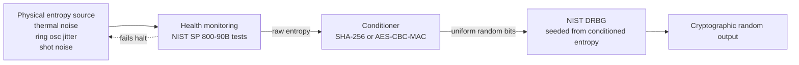

*Builds on: §1.1 Signing & verification.*

## The mental model

Every cryptographic operation that generates a key, picks a nonce, or chooses an IV needs **unpredictable randomness**. Pseudo-random functions are deterministic — given the same seed, they produce the same output. So the question becomes: where does the seed come from?

The answer is hardware. Modern security-critical silicon includes a **True Random Number Generator (TRNG)** — a circuit that extracts entropy from physical phenomena. This is fundamentally different from a software PRNG, and the distinction is what lets us bridge from physical reality to cryptographic guarantees.

## The four-stage architecture

## Walkthrough

**Stage 1 — Physical entropy source.** A circuit producing bits that are inherently unpredictable. Common sources:

- **Thermal noise** — random voltage fluctuations from Brownian electron motion. Sample at a comparator, get random bits. Most common in modern silicon.
- **Ring oscillator jitter** — multiple oscillators drift unpredictably; sample timing relationships. Common in FPGAs and embedded chips.
- **Shot noise** — discrete electrons crossing semiconductor junctions produce statistical fluctuations.
- **Quantum sources** — radioactive decay timing, single-photon detection, vacuum fluctuations. Provably unpredictable from physics, not just complexity.

Raw output is biased and correlated — maybe 60% ones, with weak inter-bit dependencies. Not directly usable.

**Stage 2 — Health monitoring.** Statistical tests run continuously on the raw stream. NIST SP 800-90B specifies the required tests. If the source degrades (chip overheating, age, attack), tests fail and the TRNG halts rather than emitting bad randomness.

**Stage 3 — Conditioner.** A cryptographic function (SHA-256 or AES-CBC-MAC) applied to chunks of raw entropy. This whitens the output — removes bias and correlation, producing uniform random bytes. It also concentrates entropy, but it never *creates* it: if the raw source has only 0.5 bits of true entropy per bit, you must feed in at least two raw bits for every full-entropy output bit. Conditioning packs existing entropy into fewer, full-entropy bits — it can't manufacture more.

**Stage 4 — DRBG.** A NIST-approved deterministic random bit generator, seeded from conditioned entropy. Software reads from the DRBG. Re-seeded periodically from the physical source. This gives high throughput with cryptographic strength.

## Where TRNGs live

Modern security silicon almost always includes one:

- **Intel CPUs** — `RDRAND` and `RDSEED` instructions, backed by on-die DRNG
- **AMD CPUs** — same instructions, different implementation
- **ARM CPUs** — `RNDR`/`RNDRRS` via the optional FEAT_RNG extension (Armv8.5-A and later)
- **TPMs** — every TPM has one, exposed via `TPM2_GetRandom`
- **HSMs** — multiple redundant TRNGs, often FIPS-certified for entropy quality
- **Smartcards / YubiKeys** — every secure element has its own
- **GPUs (NVIDIA, AMD)** — modern GPUs include hardware TRNGs
- **Mobile SE (Apple Secure Enclave, Android Titan M)** — TRNG is core

## What happens when TRNGs fail

Famous RNG disasters

Debian OpenSSL 2006-2008: a patch accidentally removed entropy from OpenSSL seeding. For two years, Debian-based systems generated SSH and TLS keys from only 32,768 possible seeds — all of them trivially enumerable. Hundreds of thousands of certificates had to be revoked. Dual_EC_DRBG: a NIST-standardized DRBG containing constants believed (and Snowden-confirmed) to be a NSA backdoor. Withdrawn in 2014. Sony PlayStation 3: ECDSA firmware signing used the same nonce for every signature, leaking Sony's signing key from publicly observable signatures.

## The philosophical note

Is true randomness physically possible? Classical thermodynamics says the universe is deterministic in principle; what we call randomness is ignorance of initial conditions. Quantum mechanics treats certain measurement outcomes as fundamentally undetermined — and Bell-inequality violations rule out *local hidden-variable* explanations, which is why quantum measurement is treated as a genuine entropy source.

For cryptography, the distinction is academic. Anything that takes more than 2^128 operations to predict is "random enough." A quantum noise source plus SHA-256 conditioning gets you there comfortably.

Takeaway

True randomness comes from sampling physical noise, passing it through statistical health checks, conditioning it cryptographically, and seeding a software DRBG. Every cryptographic guarantee above this rests on the TRNG being unpredictable — break the TRNG and the entire stack collapses silently.

