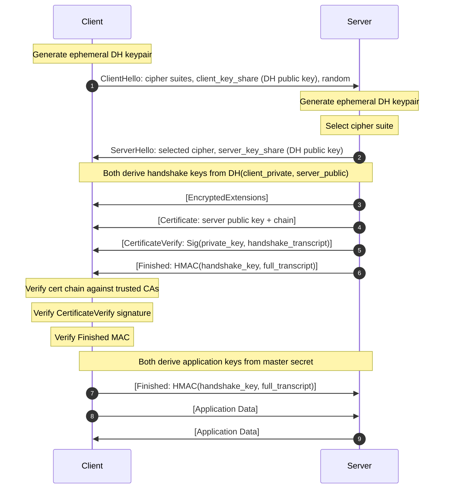

*Builds on: §1.1 Signing & verification, §1.2 Key hierarchy (previews §2 PKI).*

## The mental model

TLS solves two problems simultaneously: **authentication** (is this really the server I think it is?) and **confidentiality** (can anyone else read this?). It solves them in order — authenticate first, then derive keys for encryption — and it separates the long-lived identity credential (the certificate) from the short-lived session key (Diffie-Hellman).

TLS 1.3 completes in one round trip. The client sends its Diffie-Hellman public key up front in the ClientHello. The server replies with everything — its own DH share, certificate, and proof of identity — in a single flight. Both sides can derive the same session keys without the server learning anything that would let it decrypt past sessions (forward secrecy).

Three primitives from earlier pages all appear:

- **Digital signatures** (1.1) — the server signs the handshake transcript to prove it holds the private key matching the certificate
- **PKI and certificates** (§2.1–2.2 preview) — the certificate is a signed binding of a public key to a name; the client verifies the chain back to a trusted CA
- **Key hierarchy** (1.2) — a master secret is derived from the DH exchange, then expanded into separate encryption and MAC keys for each direction

## The TLS 1.3 handshake

## Walkthrough

**1.** The client generates a fresh ephemeral DH keypair for this session and sends its public half in the ClientHello. It also sends the list of cipher suites it supports and a random nonce (to prevent replay attacks).

**2.** The server generates its own ephemeral DH keypair, selects a cipher suite, and sends its public half back in the ServerHello. At this point both sides can compute the same DH shared secret — the client from `(server_public, client_private)`, the server from `(client_public, server_private)`. This shared secret is expanded into a set of handshake keys using HKDF.

**3–5.** The server sends its certificate (signed by a CA, binding the server's long-lived public key to its hostname), a signature over the entire handshake transcript so far (CertificateVerify, proving it holds the private key corresponding to the certificate), and a Finished MAC over the full transcript. All three messages are encrypted under the handshake keys derived in step 2.

**6–8.** The client verifies the certificate chain, checks that the signature in CertificateVerify is valid, and checks the Finished MAC. Then both sides run another HKDF expansion to derive the application-layer keys.

**9.** The client sends its own Finished MAC, and application data flows after this single round trip. (The server can optionally send "0.5-RTT" data even earlier — right after its own Finished, before the client's Finished arrives — though that early data isn't yet protected against replay.)

## Forward secrecy

The session keys are derived from the ephemeral DH values, not from the server's long-lived private key. If the server's private key is compromised later, an attacker who recorded the ciphertext still cannot decrypt past sessions — they would need the ephemeral DH private key, which is discarded at the end of the handshake. This property is called **forward secrecy** (or perfect forward secrecy, PFS).

TLS 1.2 allowed cipher suites without ephemeral DH (RSA key exchange, where the session key was encrypted under the server's certificate key). Those suites are not forward-secret — recording ciphertext and later obtaining the server's private key decrypts everything. TLS 1.3 removes those suites entirely.

TLS 1.3 vs TLS 1.2

TLS 1.2 requires two round trips before the handshake completes (ClientHello → ServerHello → client key exchange → Finished). TLS 1.3 collapses this to one round trip by sending the DH share in the first message. TLS 1.2 also supported weak cipher suites (RC4, 3DES, CBC modes without AEAD, RSA key exchange). All of these are removed in 1.3. Prefer 1.3 when you control both endpoints; if you must run 1.2 (middlebox, library, or hardware-offload constraints), restrict it to ECDHE + AEAD suites and disable RSA key exchange, RC4, 3DES, and CBC.

Certificate verification in brief

The client checks four things: the certificate has not expired, the hostname matches, the signature is valid (the CA signed it), and the CA is in the client's trust store. The full chain verification is covered in section 2.2. For now, think of a certificate as a <em>signed assertion</em>: "CA X attests that this public key belongs to example.com."

Takeaway

TLS 1.3 proves server identity (certificate + CertificateVerify), derives session keys without exposing them to the server's long-lived key (forward secrecy via ephemeral DH), and does all of this in one round trip. The handshake is a composition of signing, PKI, and key derivation — not a new primitive, just a protocol for assembling them.

