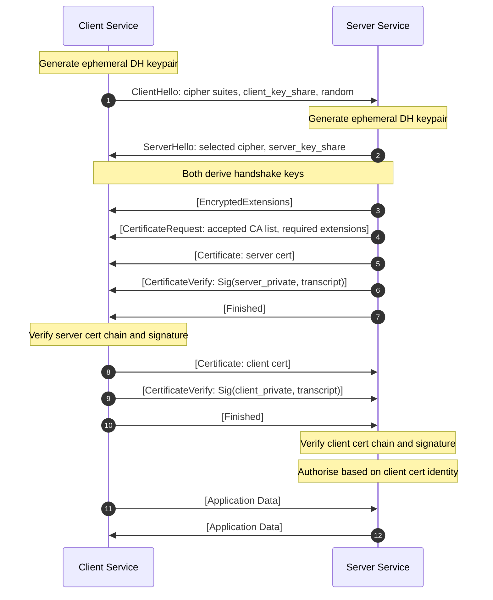

*Builds on: §1.5 TLS.*

## The mental model

In standard TLS the authentication is one-sided: the client verifies the server's certificate, but the server has no cryptographic proof of who the client is. It might check a cookie, an API key, or a bearer token — but these are application-layer secrets that can be stolen and replayed from any host.

Mutual TLS (mTLS) extends the handshake: the server also requests a certificate from the client, and the client proves it holds the corresponding private key using the same CertificateVerify signature mechanism the server already uses. After a successful mTLS handshake the server has cryptographic proof that the caller holds a specific private key, and that private key is bound to an identity via a certificate.

This makes mTLS the natural choice for service-to-service authentication: every workload gets a certificate issued by an internal CA, and the mesh rejects any call that cannot present a valid one. No bearer tokens that can be extracted from memory. No shared secrets that need rotation. Just a keypair per workload and one issuing CA.

## The mTLS handshake

## Walkthrough

**DH exchange.** The key exchange and handshake-key derivation happen identically to standard TLS 1.3.

**CertificateRequest comes first.** In TLS 1.3 the server sends `CertificateRequest` *before* its own `Certificate` (right after the mandatory `EncryptedExtensions` message). This tells the client: "I require you to present a certificate signed by one of these CAs, with these extensions." The client now knows it must provide a credential.

**Server identity.** The server then sends its own `Certificate`, proves possession of the matching private key with `CertificateVerify` (a signature over the handshake transcript), and sends its `Finished` MAC.

**Client identity.** After verifying the server, the client sends its own `Certificate` and `CertificateVerify` — the same signature-over-transcript mechanism the server used. The client's private key never leaves its host; only the signature and the public certificate travel. The client then sends its `Finished`.

**Authorisation.** The server verifies the client's certificate chain (ensuring it traces to a trusted internal CA), verifies the CertificateVerify signature, and then makes an authorisation decision based on the certificate's identity fields — typically the Subject Alternative Name (SAN) or a SPIFFE URI embedded in it.

## Certificate identity in service meshes

In a service mesh (Istio, Linkerd, Consul Connect), every workload receives a certificate with a SPIFFE Verifiable Identity Document (SVID) — a URI like `spiffe://cluster.local/ns/payments/sa/checkout` embedded in the SAN field. The receiving service can read this URI directly from the TLS handshake and enforce policy without any application-layer token passing.

Certificate issuance is handled by the mesh's control plane (acting as an intermediate CA under your root), and certificates are automatically rotated before expiry. Short-lived certificates (hours or minutes) reduce the impact of key compromise: the window during which a stolen key is useful is small, and you largely sidestep the CRL/OCSP problem — a stolen cert expires on its own before revocation would have mattered.

mTLS vs bearer tokens

Bearer tokens (JWT, opaque tokens) require the application to implement validation logic, secret distribution, and rotation. A stolen token is valid from any host until it expires. mTLS binds identity to a keypair that never leaves the host — stealing the token is not enough because the attacker also needs the private key. In practice, most zero-trust deployments use mTLS for transport identity and short-lived JWTs for fine-grained authorisation, combining both models.

TLS termination and mTLS reach

If a load balancer or ingress terminates TLS before forwarding to backend services, the backend never sees the client certificate. You must either: (a) configure the proxy to forward the client certificate in a request header (and trust that header only from the proxy), or (b) run mTLS end-to-end at the application layer. Service meshes handle this by injecting a sidecar proxy on each workload that re-establishes mTLS for the backend leg.

Takeaway

mTLS is standard TLS with one extra exchange: the server requests a certificate from the client, and the client proves possession of the corresponding private key. The result is bidirectional cryptographic authentication at the transport layer — neither side can be impersonated without stealing a private key, not just a credential.

