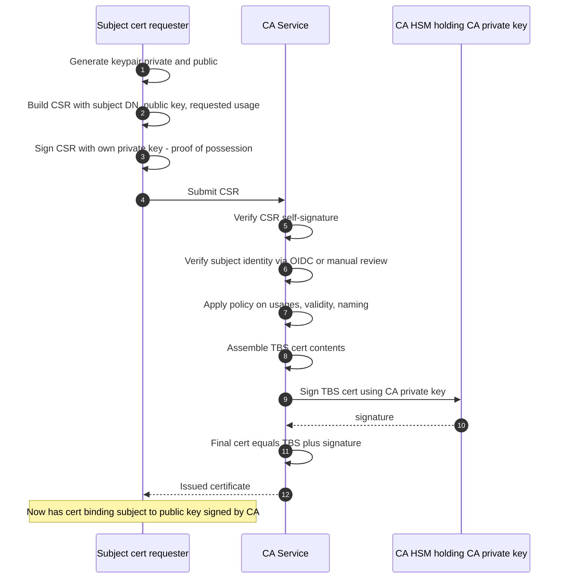

*Builds on: §1.1 Signing & verification.*

## The mental model

A certificate is just a signed statement. It says: *"I, the issuer, vouch that this public key belongs to this subject, and this binding is valid from time T1 to time T2."*

X.509 is the universal format. Important fields:

- **Subject** — who the cert is about
- **Subject public key** — the public half of the subject's keypair
- **Issuer** — who's vouching
- **Validity period** — not-before / not-after
- **Serial number** — unique within the issuer
- **Extensions** — what this cert is allowed to do (sign code? authenticate a TLS server? sign other certs?)
- **Issuer's signature** — the part that makes it real

The issuer signs over everything else. To verify a cert, you take the issuer's public key and verify that signature.

## The issuance flow

## Walkthrough

**1.** The subject generates their own keypair locally. **The CA never touches the private key.** This is the most important property of the entire PKI model: only the subject knows their private key. The CA only sees the public key.

**2–3.** The subject builds a Certificate Signing Request (CSR) — a structured document containing the subject's name, public key, and the operations they want the cert to authorize. The CSR is self-signed with the subject's private key, which proves possession (you can't sign a CSR for a public key you don't have the corresponding private key for).

**4–5.** CSR sent to the CA. CA first verifies the self-signature — confirms the subject actually holds the private key for the included public key.

**6.** Identity verification. This is where humans (or automated systems) decide whether to trust the subject's claimed identity. Could be domain control validation (Let's Encrypt), human review (high-assurance corporate CAs), OIDC token verification (Sigstore/Fulcio), or hardware attestation (device manufacturing CAs). Crucially, the CA validates identity **itself** — it does not blindly trust the names asserted in the CSR. For domain-validated web PKI it independently checks domain control and will ignore CSR-claimed names it hasn't validated. The CSR proves *key possession*, not *name ownership*.

**7.** Policy enforcement: is this subject allowed to request this cert? What's the maximum validity? Are the requested usages permitted?

**8–11.** CA assembles the to-be-signed (TBS) cert content, sends it to its HSM to sign, and gets the signature back. The CA's private key never leaves the HSM.

**12.** Final certificate = TBS data + signature. Returned to the subject. The subject now holds a CA-signed assertion about their identity and public key.

The proof-of-possession step

Step 3 (self-signing the CSR) is critical. Without it, an attacker could submit a CSR with someone else's public key and trick the CA into binding that key to a name the attacker controls. The self-signature proves 'I hold the private key for the public key I'm asking you to certify.'

Takeaway

The subject generates their own keys and proves possession. The CA verifies identity and signs. Private keys never leave their owner. This is the entire model of delegated trust in three sentences.

