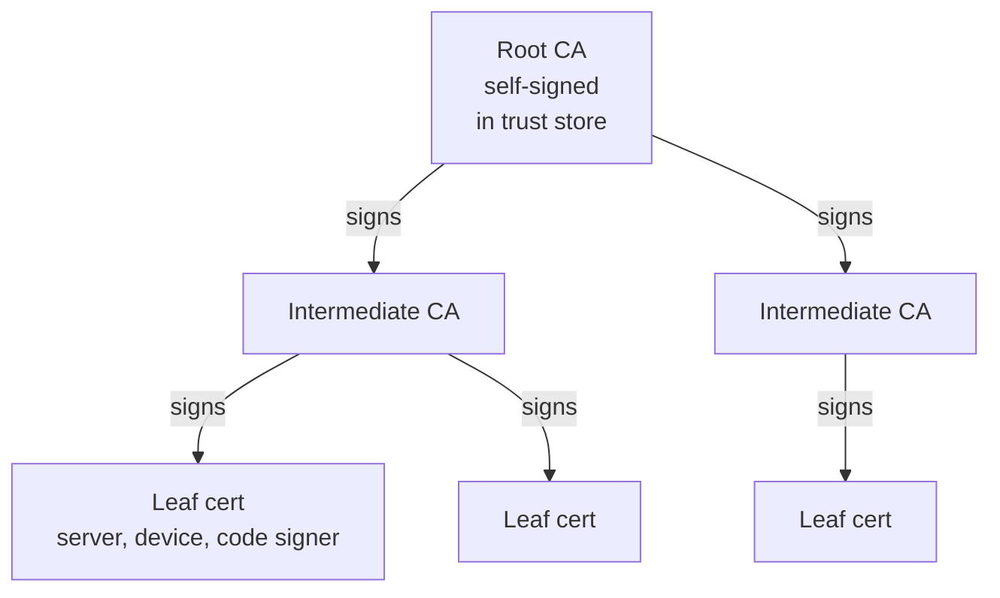
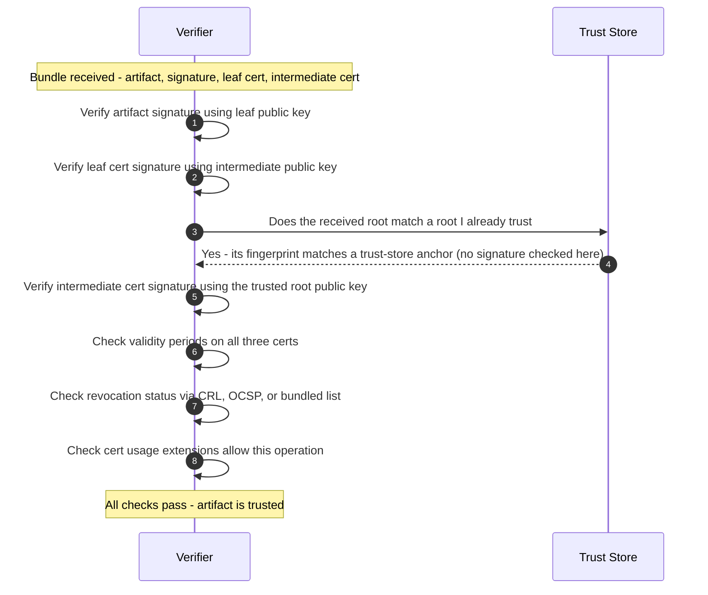

*Builds on: §2.1 Certificate issuance.*

## The mental model

When you receive a leaf cert, it doesn't stand alone. It comes with a **chain** of certificates linking it back to a trusted root. Verification walks the chain upward — each cert verified by its parent — until you reach a root your trust store recognizes.

The trust store is the only thing the verifier decides. Everything else is signature math against that anchor.

## The hierarchy

- **Root CA** — top of the chain. Self-signed. The only thing that makes you trust a root is that you've added it to your trust store.
- **Intermediate CA** — signed by the root or another intermediate. Used for day-to-day issuance so the root can stay offline.
- **Leaf** — end-entity cert, signed by an intermediate. The actual server, device, or code signer.

## The verification flow

## Walkthrough

**1.** Verify the artifact's signature using the leaf cert's embedded public key. This is the actual thing you care about — the leaf signed something, and you want to verify it.

**2–3.** But why trust the leaf? Because it's signed by the intermediate. And why trust the intermediate? Because it's signed by the root. **Each step uses the same signature-verification operation** — just applied recursively.

**4–5.** The root is the anchor — but you don't *cryptographically verify* it at all. It's self-signed, so its own signature proves nothing. Instead you check that the root you received **matches (by fingerprint) a root already in your trust store**, and then use that trusted copy's public key to verify the intermediate. The trust store is configured out-of-band — pre-installed in OSes, browsers, distributions, or firmware fuses. (Whether the anchor is a full certificate or just a pinned hash/fuse value, the principle is the same: trust comes from the pre-installed copy, not from any signature on the root.)

**6.** Time bounds matter. Every cert has not-before / not-after dates. Even a mathematically valid signature on an expired cert is rejected.

**7.** Revocation: was this cert revoked before its scheduled expiry? Mechanisms vary (CRL, OCSP, bundled lists for offline verifiers).

**8.** Usage extensions: a code-signing cert can't be used to authenticate a TLS server, and vice versa. The cert states what it's allowed to do.

Where the trust really lives

Cryptography doesn't bootstrap trust — it extends trust you already have. The root's authority comes from being in your trust store, which someone decided to put there. If an attacker can write to your trust store, no signature math above it can save you.

Takeaway

Chain verification is recursive signature checking that terminates at a pre-configured trust anchor. The math is mechanical; the trust is operational — it lives in whichever entity decides what goes into the trust store.

