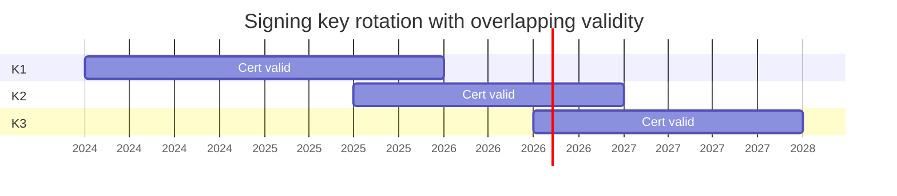

*Builds on: §2.1 Certificate issuance, §2.2 Chain verification.*

## The mental model

You have a key in production. It's signing artifacts, encrypting data, authenticating sessions. Now you need to rotate it because it's reached end of life, there's a compromise scare, or compliance requires it. The naive approach — stop the world, decrypt with old key, re-encrypt with new — doesn't work at scale.

The industry uses five patterns depending on what type of key and what constraints apply.

## Pattern 1 — Versioned keys (for encryption)

Every key has a version. Ciphertext carries the version that encrypted it.

```
{
  "key_id": "user-data-key",
  "version": 7,
  "ciphertext": "...",
  "iv": "..."
}
```

To rotate: generate v8 alongside v7. Writers use v8. Old data stays encrypted under v7 — readers can still access it. Eventually re-encrypt old data lazily (on next write) or in a background batch. **Multiple versions are simultaneously valid.**

## Pattern 2 — Overlapping cert validity (for signing)

Signing keys are harder because previously-signed artifacts must remain verifiable. The solution: overlapping certificate validity periods.



Multiple keys are valid at any time. Verifiers trust any of them (all chain to the same root). Rotate by switching which key signs new artifacts; old artifacts remain verifiable until their signing cert expires.

## Pattern 3 — Timestamping for long-lived signatures

What if K1's cert expires but you need to verify an artifact it signed five years ago? Solution: **trusted timestamping** (RFC 3161). When you sign, you also get a timestamp from a Time Stamping Authority proving "this signature existed at this moment." Later, even if the signing cert expired, you can verify the signature was made while the cert was valid.

Sigstore handles this differently: Rekor (the transparency log) is the timestamp authority. The log entry's index proves when it was added.

## Pattern 4 — Short-lived keys (Sigstore model)

Don't rotate keys; don't reuse them. Fulcio issues short-lived certs (valid for only minutes). You authenticate via OIDC, get a short-lived cert, sign one artifact, log it in Rekor, throw the key away.

- No long-lived keys to manage or worry about leaking
- Compromise of one key compromises one artifact, not a fleet
- Audit trail lives in the log, not in key management

You trade key management complexity for identity + log infrastructure complexity.

## Pattern 5 — Hybrid for PQC migration

When migrating from RSA/ECDSA to post-quantum signatures, you can't swap one for the other — verifiers may not support the new algorithm yet. **Hybrid (composite) signatures** carry two signatures over the same data: one classical, one PQC. A legacy verifier checks *only* the classical signature (the PQC one rides along in a field it ignores); an upgraded verifier checks both. So "both must verify" applies only to dual-aware verifiers — classical-only verifiers keep working throughout the transition. Gradually drop the classical signature once everyone is upgraded.

## How these connect to NVIDIA-style firmware signing

Firmware in the field for 10+ years has unique constraints:

- Rotation strategy must outlive product generations
- Firmware verifier lives in silicon — you can't easily change which trust roots a chip accepts
- Standard architecture: offline root CA (rare ceremonies), online intermediate CAs (rotated every few years), short-lived leaf signing certs (rotated quarterly)

<div class="callout"><div class="callout-label">The hierarchy of rotation frequency</div><p>Root rarely. Intermediates occasionally. Leaves frequently. Compromise of a leaf is recoverable. Compromise of the root means revoking trust in the entire signing authority — catastrophic. The frequency of rotation should be inversely proportional to the blast radius of compromise.</p></div>

<div class="takeaway"><div class="label">Takeaway</div><p>Real rotation never stops the world. You keep multiple keys valid simultaneously, lazily migrate old data, and let verification logic handle the multiplicity. The harder the constraint — long-lived firmware, multi-decade certificates — the more architectural overlap you need.</p></div>
