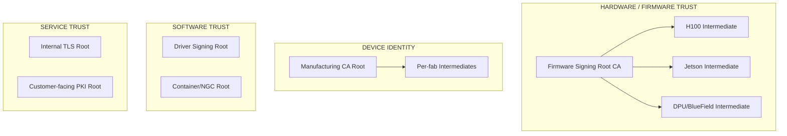

*Builds on: §2.2 Chain verification.*

## The mental model

A large organization rarely has one root CA. It has many — one per **trust domain**. A trust domain is a set of artifacts that need to verify against the same chain. Different product lines, compliance regimes, or customer audiences get their own roots.

## Why split roots

- **Blast radius isolation** — if one root is compromised, others are untouched. You don't want a single compromise to invalidate every product on Earth.
- **Different lifetimes** — firmware shipped in 2020 must verify in 2040. TLS roots rotate every 5 years. Mixing these constraints in one root is bad design.
- **Different ceremony cadence** — firmware root ceremonies might involve VP-level signoff and external auditors. TLS roots rotate routinely. Different operational tempos.
- **Different compliance regimes** — automotive, defense, and consumer products often have different FIPS / Common Criteria requirements.
- **Customer segmentation** — government or defense customers may require dedicated roots they can independently audit.

## Typical structure at a large company

## Within a single trust domain, the hierarchy goes deep

Take firmware signing. The root signs intermediates. Each intermediate covers one product line. Each product line has its own short-lived leaf signing certs that rotate quarterly. This lets you revoke "all H100 firmware signed before date X" without touching anything else.

## Device identity is separate from firmware signing

This is a subtle but critical distinction. There are two opposite-direction trust chains:

- **Firmware root** says "trust this code because it came from NVIDIA"
- **Manufacturing root** says "trust this device because it IS a genuine NVIDIA chip"

A customer cares about both. The firmware signing root verifies the code; the manufacturing CA root verifies the silicon. Two roots, two trust chains, meeting in the attestation flow.

## The trust store problem

The verifier's trust store is the weakest link

Every verification ultimately terminates at 'is this root in my trust store?' If an attacker can poison the trust store, no cryptographic property of the chain saves you. PKI extends trust; it doesn't bootstrap it. Defenses live in operational security: hardware-rooted trust stores (TPM, fuses), signed trust store updates, transparency-log cross-checks, and ultimately endpoint security on the verifier.

Takeaway

One root per trust domain. Split by blast radius, lifetime, ceremony cadence, and compliance. The hierarchy goes deep within a domain but never crosses domains — that's what keeps a single compromise from cascading.

