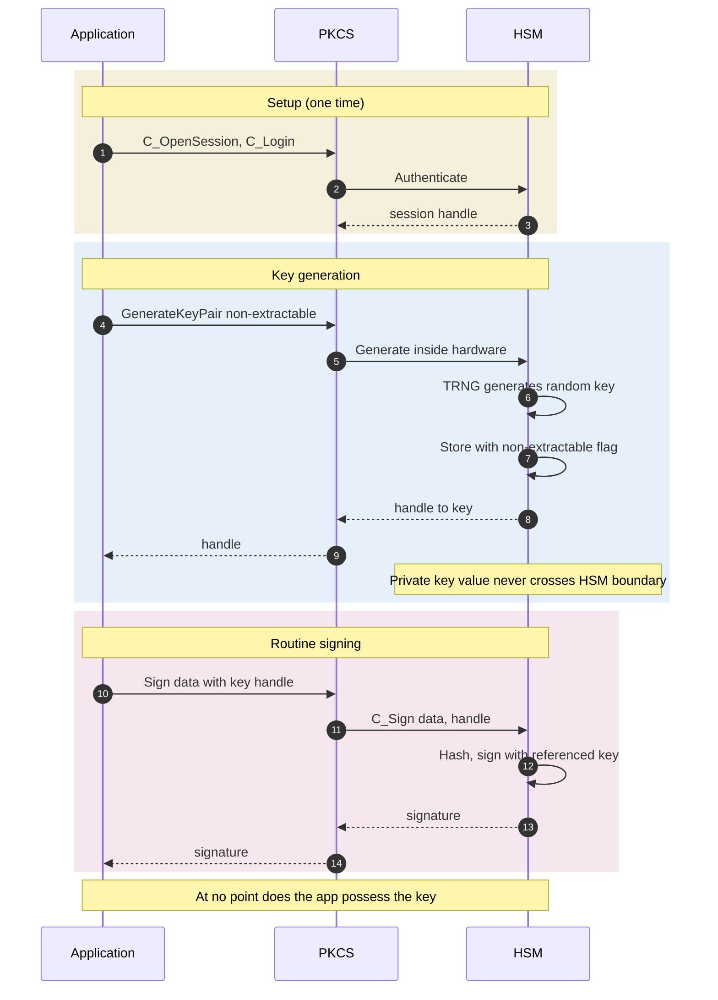

*Builds on: §1.3 PKCS#11.*

## The mental model

An HSM (Hardware Security Module) is a physical device whose only job is to hold cryptographic keys and perform operations with them — never exposing the keys themselves to the outside world. It's a black box: you send it data and a key handle, it returns a result. The trust boundary lives at the HSM's edge.

What makes an HSM more than just a server with a key on disk:

- **Tamper-resistant hardware** — sensors detect physical attack and zeroize keys
- **Crypto coprocessors** — dedicated silicon for AES, RSA, ECC operations
- **Internal TRNG** — hardware entropy source for key generation
- **Strict API contract** — typically PKCS#11; operations on handles only
- **Certified to FIPS standards** — now **FIPS 140-3** (which aligns with ISO/IEC 19790); FIPS 140-2 is legacy and moved to the historical list, security levels 1–4

## FIPS levels in one paragraph each

- **Level 1** — basic security requirements, mostly software-based. Smartphones at this level if certified.
- **Level 2** — role-based authentication, tamper-evident seals. Most cloud HSMs.
- **Level 3** — identity-based authentication, tamper-resistant (zeroize on attempted intrusion). Where most enterprise HSMs operate.
- **Level 4** — environmental failure protection (voltage, temperature), full envelope of detection. Defense and high-assurance use.

## The trust contract

## HSM types in the wild

| Type | Form factor | Use case |
| --- | --- | --- |
| Network HSM | 1U or 2U server rack appliance | Enterprise PKI, code signing |
| PCIe HSM card | PCIe card in a server | High-throughput crypto in a single host |
| USB HSM | Small USB device | Developer / individual use, dev environments |
| Cloud HSM | Managed service | AWS CloudHSM, Azure Dedicated HSM, GCP Cloud HSM |
| HSM-as-a-Service | Multi-tenant managed | AWS KMS, Azure Key Vault, GCP Cloud KMS — abstracted |

## HSM clustering and high availability

Single HSMs are single points of failure. Production deployments use clusters:

- Multiple HSMs in a trust group share the same keys via **cloning**
- Cloning happens hardware-to-hardware over encrypted channels; plaintext keys never exposed
- Operations can fail over from one HSM to another with the same key
- Different vendors handle this differently — Thales Luna has its own cluster model, AWS CloudHSM clusters are AWS-managed, etc.

HSM cloning vs key escrow

Cloning is hardware-to-hardware key transfer within an authorized trust group. It maintains the property that keys never exist outside hardware. Key escrow — keeping a plaintext copy somewhere — is a different concept and is generally avoided because it creates exactly the vulnerability HSMs are designed to prevent.

Takeaway

An HSM is the hardware boundary inside which key material exists. The whole stack above — PKCS#11 APIs, signing services, PKI hierarchies — is built around the contract that applications hold handles, the HSM holds values.

