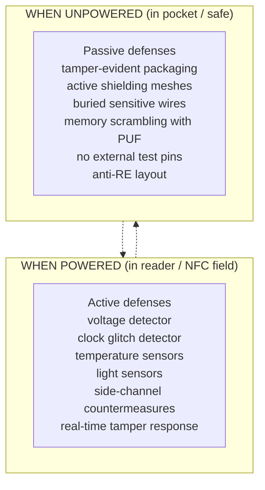

*Builds on: §3.1 HSM architecture.*

## The mental model

A smartcard is an HSM in a credit-card form factor. Same design philosophy: tamper-resistant silicon, internal crypto operations, keys never extracted in plaintext. The form factor changes (credit card, USB stick like YubiKey, embedded chip like an Apple Secure Enclave), but the security model is identical.

Understanding this is important because **smartcards are how custodians physically participate in key ceremonies**. When a custodian carries a smartcard with a key share, they're not carrying a USB stick with sensitive data — they're carrying a hardware security module the size of a fingernail.

## Inside the chip

A modern smartcard contains on a single silicon die:

- **Secure microcontroller** — 8/16/32-bit CPU with hardware memory isolation
- **Crypto coprocessor** — dedicated hardware for AES, RSA, ECC, increasingly PQC
- **True Random Number Generator** — hardware entropy source
- **Tamper-resistant non-volatile memory** — EEPROM or flash for key storage
- **Sensor mesh** — detects voltage glitches, temperature attacks, light, EM probes
- **Active shielding** — metal mesh detecting mechanical intrusion

## Active vs passive defenses

Active defenses require power. When the card is in a reader or NFC field, the chip is drawing power and all sensors are running. Take the card out of the reader, all active defenses go dormant.

Passive defenses work always — they're properties of the silicon's physical construction. Attacks against an unpowered card must defeat the passive defenses, which means physical decapsulation, focused ion beam workstations, and hundreds of thousands of dollars per extracted key. For most threat models, this raises the attack cost far above the value of any one share.

## The operational layer adds another redundancy

Beyond hardware, there's the human layer:

- Card kept in tamper-evident pouch
- Stored in a personal safe at home or at the office
- Loss reported immediately, share considered compromised, re-sharing ceremony convened
- Audit logs show any time the card authenticated

The card doesn't have to be invincible against an unbounded lab attack — it has to be expensive enough that the cost exceeds the value of one share, plus M-1 others, by a wide margin.

## Concrete instances you'll see

| Device | Use case |
| --- | --- |
| YubiKey | WebAuthn, OTP, smartcard functions, PIV |
| US PIV cards (HSPD-12) | Federal employee identity cards |
| DoD CAC cards | Department of Defense identity cards |
| Apple Secure Enclave | iOS biometric and credential storage |
| Android Titan M / M2 | Pixel device secure element (M2 on Pixel 6 and later) |
| Google Titan key | Hardware authenticator |
| TPM 2.0 chips | Fixed installation on motherboards / SoCs |

This table mixes *removable* cards (YubiKey, PIV, CAC) with *embedded* secure elements (Secure Enclave, Titan, TPM) — same trust model, different attachment.

## The continuum with HSMs

Smartcards and HSMs are points on the same spectrum

Same design philosophy — hardware-isolated keys, operations on handles, PKCS#11-style API. Differences are operational: throughput, key count, physical form, FIPS certification level, network vs. local interface. A YubiKey is a 'small, slow, USB-attached HSM.' A Thales Luna is a 'big, fast, network-attached HSM.' Same trust contract, different ergonomics.

Takeaway

When designing custody mechanisms, smartcards aren't 'just storage' — they're hardware security modules. Plaintext key material lives only inside their tamper-resistant boundary. Two hardware endpoints (HSM and smartcard) pass key material to each other over public wires using session encryption.

