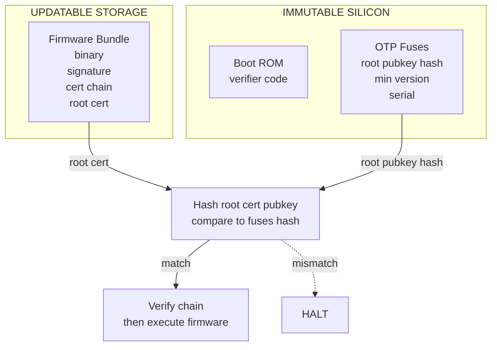

*Builds on: §1.1 Signing & verification.*

## The mental model

Every secure boot chain must terminate at **something the chip cannot lie about**. That something is OTP fuses — one-time programmable bits etched into silicon during manufacturing. Once burned, they cannot be changed. They are the immutable foundation that everything else stands on.

The fuses don't contain the entire root CA public key — they contain its **hash**. The full key travels with the firmware bundle; the hash in fuses is just enough to verify the key hasn't been swapped.

## What lives in fuses

| Field | Purpose |
| --- | --- |
| Root pubkey hash (SHA-256 or SHA-384) | Anchor for firmware signature verification |
| Backup root pubkey hash | Recovery in case primary root is lost |
| Anti-rollback minimum version | Prevents downgrade attacks |
| Chip serial number | Per-device identity component |
| Feature enable flags | Production / debug mode, fused at factory |
| EK material derivation seed (in some designs) | For per-device key derivation |

## The trust handoff from hardware to software

## Walkthrough

**1.** Boot ROM reads the root pubkey hash from fuses. This is hardware-level access — no firmware involved, no possibility of substitution.

**2.** Boot ROM reads the firmware bundle from flash. The bundle contains the root certificate (with the full root public key inside it), plus the signature chain down to the firmware itself.

**3.** Boot ROM hashes the root certificate's public key and compares it to the value in fuses. **This is the moment of hardware-to-software trust transition.** If the hash matches, the root certificate in the bundle is authentic — it's the same root that was designated at silicon manufacturing time.

**4.** If the hashes match, the boot ROM proceeds to verify the entire signature chain using the now-trusted root public key.

**5.** If the hashes don't match, an attacker has substituted a different root cert. The boot ROM halts immediately. No firmware runs.

## Why a hash, not the full key

Fuses are expensive. Each fused bit takes physical silicon area. Storing a full RSA-4096 modulus in fuses would burn ~512 bytes — significant. (Most modern roots are ECDSA/EdDSA anyway — a P-384 key is ~96 bytes, Ed25519 just 32 — but a hash is ~32 bytes regardless of key type or size, which is why it's the cheap, consistent choice that matches the "few hundred bits" in the takeaway.)

The hash also makes the design algorithm-agnostic. The fuses don't care whether the root uses RSA, ECDSA, EdDSA, or ML-DSA — as long as the hash matches, any algorithm works. This matters for the PQC migration: when post-quantum signatures roll out, chips with hash-based fuses can switch root algorithms without re-spinning silicon.

## The implications of immutability

The root cannot rotate during the chip's lifetime

If a chip's fuses are burned with root pubkey hash X in 2024, that chip will only ever trust a root with pubkey hashing to X. Forever. You can never update it. This means: the root key generated in 2024 must remain trustworthy and operational until the last chip from that generation is decommissioned, possibly 15-20 years later. Compromise of the root key is catastrophic and unrecoverable for already-shipped chips. This is why root ceremonies are taken so seriously.

## What happens if the boot ROM has a bug

The boot ROM is in silicon — frozen at fabrication. If it has a vulnerability, the entire chain collapses and there is no software fix. The famous example is **checkm8** (2019), a boot ROM exploit in Apple A5 through A11 chips. Because the BootROM is frozen in silicon, Apple can't patch it — the vulnerability is permanently unpatchable in those chips, enabling *tethered* unsigned code execution (it must be re-triggered over USB on each boot; it isn't persistent by itself). It lives until those devices are decommissioned.

This is why boot ROM code is intentionally minimal — just a few kilobytes — and goes through extreme review. Less code, fewer bugs.

Takeaway

The OTP fuses are the only mutable thing in the trust chain — and they can only mutate from 0 to 1, once per bit, at factory time. Everything else rebuilds from this foundation on every boot. The root of trust is literally a few hundred bits in silicon.

