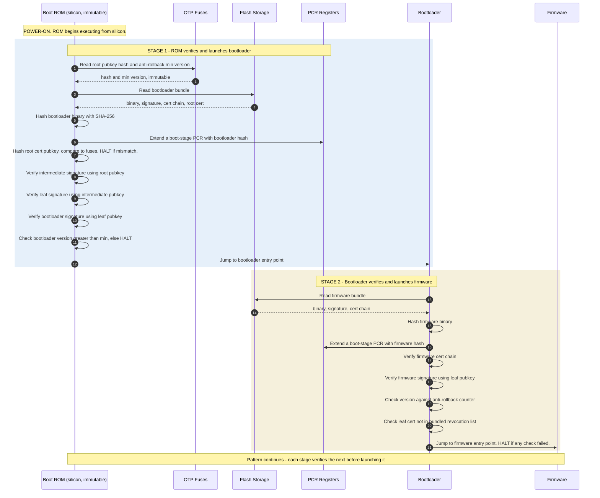

*Builds on: §3.3 OTP fuses, §1.1 Signing & verification.*

## The mental model

Secure boot is a chain of stages, each verifying the next stage's signature before launching it. The chain starts in immutable silicon (boot ROM + OTP fuses) and extends upward through bootloader, firmware, kernel, etc. **At every link, an invalid signature halts the chain.** Nothing unsigned ever runs.

The pattern at each stage is identical: read next binary, hash it, extend a PCR (measured boot), verify its signature, execute or halt.

## The full sequence



## The recurring five-step pattern

Every stage does exactly the same things before yielding control:

1. **Read** the next stage's binary from storage
2. **Hash** the binary
3. **Extend** the appropriate PCR with the hash (measured boot — separate from verification; which PCR follows the TCG index conventions on the [measured boot](05-measured-boot.md) page)
4. **Verify** the signature on the binary using the trust chain
5. **Execute** the next stage, or **HALT** if any check failed

This pattern is identical from boot ROM down through every subsequent stage.

## The bundle layout

Each firmware bundle on flash contains:

```
firmware_bundle = {
  binary,
  signature,
  leaf_certificate,
  intermediate_certificate,
  root_certificate,
  revocation_list   // optional, bundled for offline use
}
```

Everything needed for verification ships with the binary. The only piece not in the bundle is the trust anchor (root pubkey hash in fuses) — that comes from hardware. **Verification is fully offline.** No network. No HSM call. No CA query.

## Critical: measure AND verify, separately

Each stage does two independent things in parallel:

- **Secure boot** (verification) — decides whether to execute
- **Measured boot** (PCR extend) — records what executed

These are not the same operation. The verification uses the freshly-computed hash and compares against what the signature asserts. The PCR write is a separate side effect.

<div class="callout warn"><div class="callout-label">Why both are needed</div><p>Secure boot prevents most attacks at the gate. But if a signing key is ever compromised, an attacker could produce a maliciously signed but valid binary that passes secure boot. Measured boot ensures that compromise is detectable — the malicious binary's hash gets recorded in the PCR, and remote attestation will reveal the PCR doesn't match the expected reference value. Secure boot is prevention, measured boot is detection.</p></div>

## What happens on failure

If any signature check fails, the chain breaks. Common responses:

- **Hard halt** — chip becomes inert until power cycle
- **Recovery firmware** — separate signed image in protected flash takes over to allow re-flashing (the most common response)
- **Permanent disable** — rare, only on devices with an explicit anti-tamper policy; most devices fall back to recovery mode rather than permanently bricking

The point: unsigned or tampered code never runs. There is no "log and continue" or "warning mode." Boot is binary.

<div class="takeaway"><div class="label">Takeaway</div><p>Secure boot is the same five-step pattern repeated at each stage — measure, hash, extend PCR, verify signature, execute or halt. The trust chain extends upward from immutable silicon, with each link verifying the next before yielding control.</p></div>
