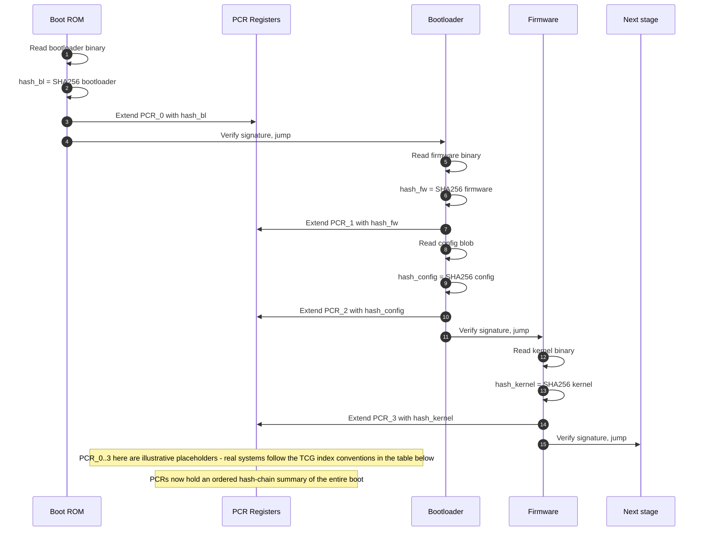

*Builds on: §3.4 Secure boot.*

## The mental model

A **Platform Configuration Register (PCR)** is a small register inside the TPM or secure boot region of a chip with two special properties:

1. You cannot write to it directly. There is no "set PCR to value X" operation.
2. You can only **extend** it.

That's the whole trick. The extend operation is:

```
PCR_new = HASH(PCR_old || new_measurement)
```

Take the current PCR value, concatenate the new measurement, hash the result, store as the new PCR value. This produces a cryptographically unforgeable summary of "everything that was measured, in order."

## What the extend operation guarantees

- **Append-only** — every extend includes all previous extends as input, so history can never be erased
- **Order-sensitive** — extending with A then B produces a different result than B then A
- **Tamper-evident** — change any one measurement, and the final PCR is completely different (avalanche property)
- **One-way** — you can verify forward (recompute from a list of measurements) but not reverse (can't extract original measurements from a PCR value)

## How PCRs get filled during boot



## Walkthrough

**Each stage does this before yielding to the next:**

1. Read the next binary
2. Hash it
3. Extend the appropriate PCR with the hash
4. Verify the signature (separate operation, doesn't read the PCR)
5. Jump to the next binary's entry point

By the end of boot, the PCRs contain a complete record of every binary that ran, in order. A verifier holding the expected reference values for a clean boot can compare and detect any divergence.

## PCR conventions (TCG spec)

| PCR | Conventional contents |
| --- | --- |
| PCR[0] | Boot ROM / immutable firmware |
| PCR[1] | Platform configuration data |
| PCR[2-3] | Option ROMs / firmware extensions |
| PCR[4] | Bootloader / IPL code |
| PCR[5] | Bootloader configuration |
| PCR[7] | Secure boot policy and keys |
| PCR[8-15] | OS-controlled measurements (kernel, initramfs, etc.) |

Different things go into different PCRs so verifiers can reason about them independently. "The firmware is fine (PCR[0] matches) but the configuration changed (PCR[1] differs)" — that distinction is useful.

## The event log — making PCRs interpretable

A final PCR value is opaque — just a 32-byte hash. To make it interpretable, the system also maintains an **event log**: a sequential list of what was measured into which PCR, including the original measurement values and labels.

The event log is untrusted on its own — anyone could fake it. It's trusted because **replaying it through the extend formula must produce the same PCR values the TPM signed**. The PCR signature is the trust anchor; the event log is the explanation.

## The crucial invariant: measure before execute

<div class="callout crit"><div class="callout-label">Why this order matters</div><p>Each stage measures the NEXT stage BEFORE launching it. Never after. This is what makes the chain unbreakable — by the time a compromised stage is running, its hash has already been recorded in a PCR that it cannot modify. A malicious bootloader can do many bad things, but it cannot un-measure itself. Its presence is permanently recorded in PCR by the immutable boot ROM before it was given control.</p></div>

## When PCR updates stop

After boot reaches a defined "operational state," PCR extension typically stops or is locked. You don't want every userspace process extending PCRs — that would make them change constantly. Some PCRs become read-only for the rest of the power cycle. Next change requires a reboot, which clears all PCRs and rebuilds from the immutable ROM.

<div class="takeaway"><div class="label">Takeaway</div><p>PCRs are hash-chain registers that build an append-only, tamper-evident fingerprint of boot. The fingerprint is opaque alone but interpretable with the event log. Together they enable any verifier to confirm what actually ran by comparing to expected reference values.</p></div>
