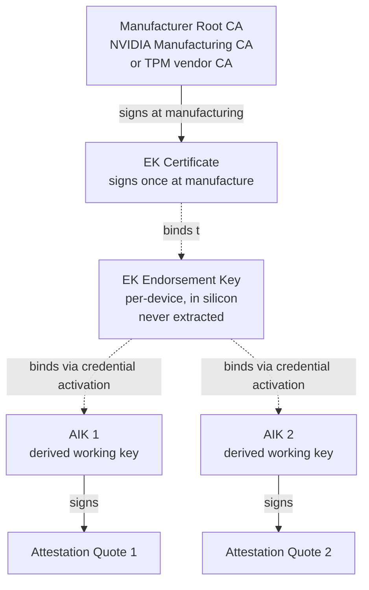

*Builds on: §3.1 HSM, §1.1 Signing & verification.*

## The mental model

Every modern secure chip has a **per-device, hardware-isolated identity key**. The TPM standard calls it the EK (Endorsement Key). NVIDIA GPUs, mobile secure enclaves, IEEE 802.1AR devices all use analogous concepts under different names. The pattern is universal.

What makes it different from a normal key: **it's generated inside the chip's hardware boundary, certified by the manufacturer, and never extracted from the chip in plaintext.** It's the chip's permanent cryptographic identity, fixed for the life of the device.

## The two-layer identity model

## EK — the permanent identity

- Generated inside the chip at manufacturing using the chip's internal TRNG
- Private key stored in "shielded location" — silicon region with hardware access control even firmware cannot read
- Public key extracted once at manufacture, NVIDIA (or the chip vendor) signs an Endorsement Certificate binding it to the device serial number
- EK is used sparingly — exposing it across many services would let them correlate "that's the same device" (privacy concern)

## AIK — the working key

- Generated inside the chip when needed, separate from EK
- The AIK is bound to the EK through **credential activation**, not by an EK signature — in TPM 2.0 the EK is a decryption-only key and cannot sign. A CA (the manufacturer's, or a privacy CA) issues the AIK certificate after encrypting a challenge to the EK's public key; only the chip holding that EK can decrypt the challenge, which proves the AIK lives in the same device as the certified EK
- AIK does the actual day-to-day signing of attestation quotes
- One device can have many AIKs — one per service, one per context, rotated periodically
- This indirection adds privacy: services see different AIKs, can't correlate the device identity directly

Textbook vs. reality

<strong>You may have learned:</strong> "the EK signs the AIK's certificate," as if the chip held a mini-CA.

<strong>What actually happens:</strong> in TPM 2.0 the EK is a <em>restricted decryption key</em> — it physically cannot sign. The AIK is bound to the EK by <strong>credential activation</strong>: a CA encrypts a challenge to the EK's public key, and only the genuine chip can decrypt it, proving the two keys are co-resident. (Some ecosystems — NVIDIA GPUs, IEEE 802.1AR IDevID — really do use a <em>signing</em> identity key, so there the "identity key signs the working key" picture is closer to literally true.)

## Why two layers

Same pattern as PKI everywhere else: a rarely-used, long-lived root identity (EK) certifies short-lived working keys (AIKs) that handle volume. Long-lived roots have high blast radius; using them sparingly limits exposure. Working keys can be rotated or scoped without disturbing the root.

## The standardized terminology (IEEE 802.1AR)

The newer naming you'll see:

- **IDevID** (Initial Device Identity) — manufacturer-installed permanent identity; plays the same *role* as the EK (permanent manufacturer identity), though the key usage differs — an IDevID is a *signing* credential, whereas the TPM EK is a *decryption* key
- **LDevID** (Locally significant Device Identity) — keys provisioned later for specific deployment contexts = analog of AIK

NVIDIA uses similar concepts under their own naming, and Intel SGX uses related attestation keys. Apple's WebAuthn/passkey attestation follows the same shape but with a deliberate twist: it's intentionally **anonymized per device** (a batch key, not a per-device identity) to avoid cross-site tracking — a privacy-first variant of the pattern, covered in §5.3.

## What's actually stored on the chip

| Storage type | Contents | Mutability |
| --- | --- | --- |
| ROM (mask ROM) | Boot code, root of trust verifier logic | Frozen at design time |
| OTP fuses | Firmware root pubkey hash, chip serial, feature flags | Write-once, 0 to 1 only |
| Shielded key storage | EK private key (generated in-chip) | Set once at manufacturing, never readable |
| Secure SRAM | Working session keys, derived keys (AIK, etc.) | Volatile, regenerated as needed |
| Flash / NVMe | Firmware images, certificates, revocation lists | Updatable via signed updates |

The OTP fuses and shielded storage are the anchors that cannot lie. Everything else is checked against them.

## Two opposite-direction trust chains

This is the key insight that unifies the picture:

| Trust chain | What it proves | Anchor |
| --- | --- | --- |
| Firmware signing chain | The CODE is genuine NVIDIA | Firmware root pubkey hash in fuses |
| Device identity chain | The HARDWARE is genuine NVIDIA | EK signed by Manufacturing CA |

A customer cares about both. They want to know the silicon is genuine AND the code running on it is genuine. Two trust chains, two roots, both rooted in NVIDIA infrastructure, meeting in remote attestation.

Takeaway

Every secure chip has a per-device identity key generated at manufacturing and never exposed. A two-layer identity model (permanent root key + derived working keys) gives both strong identity and operational privacy. This pattern is universal across TPMs, smartphones, secure enclaves, and NVIDIA GPUs.

