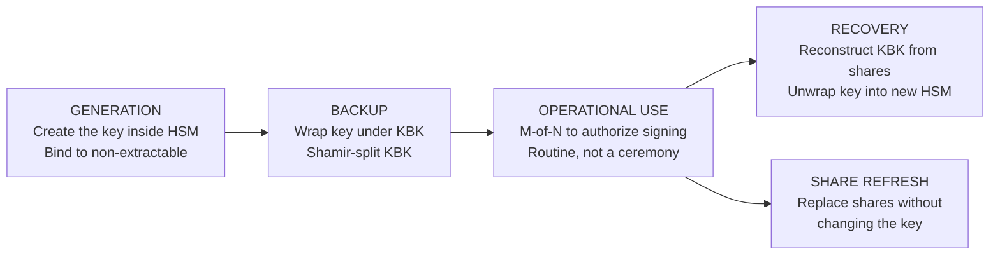

*Builds on: §3.1 HSM, §3.2 Smartcards.*

## The mental model

A **key ceremony** is the formal, auditable process of generating, backing up, or recovering a high-value cryptographic key. It's called a ceremony because it has the structure of a ritual: multiple witnesses, scripted procedure, video recording, signed attestation, all in a controlled physical environment.

The ceremony exists because the value being protected isn't just the key itself — it's the trust assertion the key represents. NVIDIA's firmware signing root signs code that runs on millions of GPUs. Compromise of that root key would invalidate the trust customers place in every NVIDIA product. The ceremony is what makes that key worth trusting.

## What's in a ceremony

| Element | Purpose |
| --- | --- |
| Secure facility (often a SCIF or equivalent) | Physical control of the environment, no surveillance |
| Air-gapped HSM | The key is generated inside hardware that's never on a network |
| M-of-N custodians with smartcards | No single person can use or recover the key |
| External auditor | Independent verification that the script was followed |
| Signed ceremony script | Pre-defined procedure, deviations require approval |
| Video recording | Permanent evidence of compliance |
| Shamir-split key backup | Recovery possible without single-party access |

## Four ceremony types (plus routine use)

The ceremonies cover different points in the key lifecycle — generation, backup, recovery, and share refresh. (Operational *use* of the key is a routine M-of-N authorization, not a ceremony.)

## The two M-of-N policies

Custodians serve in two distinct roles. Both use M-of-N quorums but they protect against different things:

| Policy | Protects against | Active when |
| --- | --- | --- |
| M-of-N authentication to USE the key | A single rogue insider performing unauthorized signings | Every signing operation on a high-value key |
| M-of-N share reconstruction to RECOVER the key | Loss of the primary HSM | Disaster recovery only |

The same custodian set often serves both roles, but the policies are independent. You could have 3-of-5 for routine use and 5-of-7 for recovery.

## The custodian model

Custodians are individuals — typically senior engineers, security officers, or executives — who carry smartcards containing share material. Their responsibilities:

- Physical custody of their smartcard (often in a tamper-evident pouch, personal safe)
- Immediate reporting of any suspected loss or compromise
- Periodic participation in ceremonies (authorize use, perform refresh, participate in recovery)
- Bound by organizational policy and often legal contract

The smartcard is itself a hardware security module — same design philosophy, smaller form factor. The custodian carries hardware-protected secret material, not a USB stick with sensitive data on it.

Why this matters

Process discipline matters as much as cryptographic depth. Describing a key ceremony as just "generate a key inside the HSM" misses the point — the actual procedure is at least 50% non-technical: choreography, witnessing, attestation, and recovery planning. The cryptography makes the key strong; the ceremony makes the trust in it defensible.

Takeaway

Key ceremonies aren't just technical procedures — they're auditable trust establishment rituals. The cryptography ensures the key is strong; the ceremony ensures the trust placed in it is justified.

