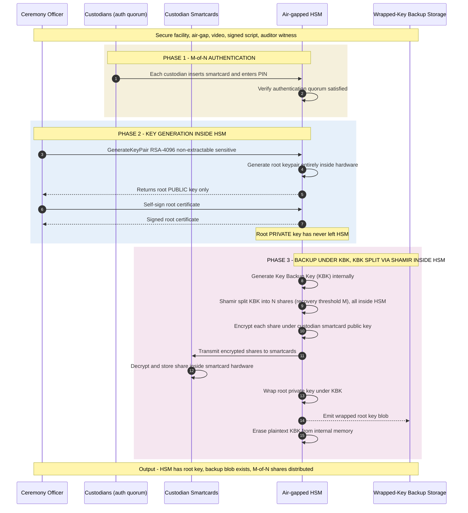

*Builds on: §4.1 Key-ceremony overview.*

## The mental model

The root key generation ceremony is the most consequential single event in a PKI's lifetime. The key generated here will sign every artifact, every certificate, every attestation for the next decade or more. If the ceremony has any flaw — a weakness in the HSM's RNG, a compromised custodian, a tampered script — the entire chain of trust above it is suspect.

The output of the ceremony is a key that exists in exactly one place: inside an air-gapped HSM, with no plaintext copy anywhere in the universe.

## The full ceremony flow

## Walkthrough by phase

### Phase 1 — Authentication

The custodians arrive at the secure facility. Each presents their smartcard and authenticates to the HSM. The HSM enforces the policy: only when M-of-N custodians have authenticated does it allow the next operation. **Authentication, not key reconstruction** — the custodians' smartcards hold credentials, not yet key share material.

### Phase 2 — Key generation

The ceremony officer issues the key generation command. Critical attributes:

- `CKA_EXTRACTABLE = FALSE` — the key can never leave the HSM in plaintext
- `CKA_SENSITIVE = TRUE` — the value cannot be read back even by privileged users

The HSM generates the keypair using its internal TRNG. The private key exists only inside the HSM. The public key is returned. The officer self-signs the root certificate — the root signs an assertion about its own public key.

### Phase 3 — Backup via wrapped key + Shamir-split KBK

This is the subtle part. We need the key to be recoverable if the HSM is lost, but we also can't let the plaintext key exist outside the HSM.

The HSM generates a Key Backup Key (KBK) internally. It Shamir-splits the KBK into N shares with a **recovery threshold M** (the polynomial has degree M−1) — **all inside the HSM**. Note that M is the *recovery* threshold and need not equal the authentication quorum from Phase 1: you might authorize the ceremony with 3-of-N but require 5-of-7 to recover.

Each share is then delivered to a custodian's smartcard (smartcards are themselves mini-HSMs). In practice the HSM and each smartcard first establish a **mutually-authenticated session**, then transfer the share over it; "encrypt under the smartcard's public key" is shorthand for that — a bare public-key encryption wouldn't confirm the share actually reached the intended card. Each smartcard decrypts and stores its share inside its own hardware boundary.

Finally, the HSM uses the KBK to wrap (encrypt) the root private key. The wrapped blob is emitted to backup storage. The plaintext KBK is erased from HSM memory.

The plaintext invariant

At no point in this entire ceremony does plaintext key material exist outside a hardware boundary. The root private key lives in the HSM. The KBK lived in the HSM until it was erased. The shares live in smartcards. The wrapped blob is ciphertext. The host operating system never sees anything in plaintext.

## What the ceremony produces

After the ceremony, you have:

- A root private key inside the HSM (non-extractable)
- A self-signed root certificate to distribute publicly
- A wrapped root key backup blob (in encrypted backup storage)
- N smartcards, each holding one encrypted Shamir share of the KBK
- A signed ceremony attestation from the external auditor
- A video recording archived for future audits

Takeaway

Generation ceremony output is more than just a key — it's a complete trust establishment package. The key, its public certificate, its backup mechanism, and the audit evidence all derive from this single event.

