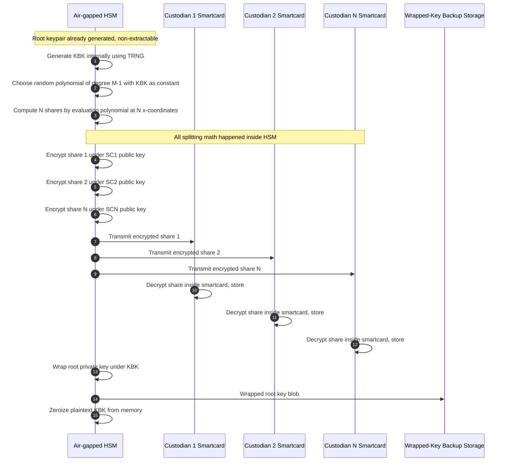

*Builds on: §4.2 Root key generation.*

## The mental model

You've generated a root key inside an HSM with `CKA_EXTRACTABLE = FALSE`. The key cannot be exported. Good — that's exactly the property you wanted. But now what happens if the HSM dies, gets stolen, or its vendor goes out of business?

The solution is **backup via a Key Backup Key (KBK)**, with the KBK protected by Shamir's Secret Sharing across multiple custodians.

## What the HSM does NOT do

The naive misunderstanding

The HSM does NOT split the root private key into shares and hand them out. If it did, the plaintext private key would have to exist outside the hardware boundary momentarily — which defeats the entire purpose of using an HSM. The plaintext key material never leaves the HSM in any form.

## What actually happens

Three things, in this order, all inside the HSM:

1. HSM generates a Key Backup Key (KBK) — a new key, separate from the root
2. HSM Shamir-splits the KBK into N shares, encrypted to custodian smartcards
3. HSM wraps the root private key under the KBK, emits the wrapped blob

Shamir's Secret Sharing applies to the **KBK**, not to the root key directly. The root key is protected by a single wrap; the KBK is protected by being split among custodians.

## Shamir's Secret Sharing in 60 seconds

Shamir's scheme splits a secret S into N pieces such that any M of them can reconstruct S, but fewer than M reveal nothing. Mathematically: pick a random polynomial of degree M-1 with S as the constant term. The N shares are evaluations of the polynomial at N distinct x-coordinates. Given M points on a degree-(M-1) polynomial, you can reconstruct it (Lagrange interpolation). Given fewer, you have **information-theoretically zero** information about S.

That last property is crucial. Shamir is not just hard to break with fewer than M shares — it's mathematically impossible. The remaining unknowns are uniformly distributed across all possible values.

One detail that's easy to miss: **all the arithmetic happens in a finite field** (modulo a large prime, or in GF(2^k)) — not over the integers or reals. That's what makes the guarantee information-theoretic; over an unbounded domain the shares would leak partial information (ranges, magnitudes) about the secret.

## The backup flow in detail

## Why the chain of custody is sound

Let's trace where plaintext key material exists at each moment:

- **Root private key:** in plaintext only inside the HSM. Wrapped form lives in Backup storage.
- **KBK:** in plaintext only inside the HSM, briefly. Erased after wrapping operation completes.
- **Shares (plaintext):** exist briefly inside the HSM during split, then briefly inside smartcards after decryption. Never elsewhere.
- **Shares (encrypted):** transit between HSM and smartcards over the wire. The wire is untrusted, but the ciphertext is.

At no point does plaintext key material exist in untrusted memory.

## What an attacker would need

To recover the root private key from the backup, an attacker needs:

1. The wrapped root key blob (from backup storage)
2. The KBK (to unwrap the blob)
3. M out of N smartcards (to reconstruct the KBK)
4. A compatible HSM that will accept the wrapped key

Compromising any one of these gives nothing. The wrapped blob is useless without the KBK. Fewer than M smartcards reveal nothing. The HSM-to-smartcard transport is encrypted.

Takeaway

Backup splits one secret across two independent dimensions — encryption (wrapped under KBK) and threshold sharing (KBK split via Shamir). An attacker needs to defeat both dimensions to recover the key, which requires compromising multiple independent custodians plus accessing the backup storage plus obtaining a compatible HSM.

