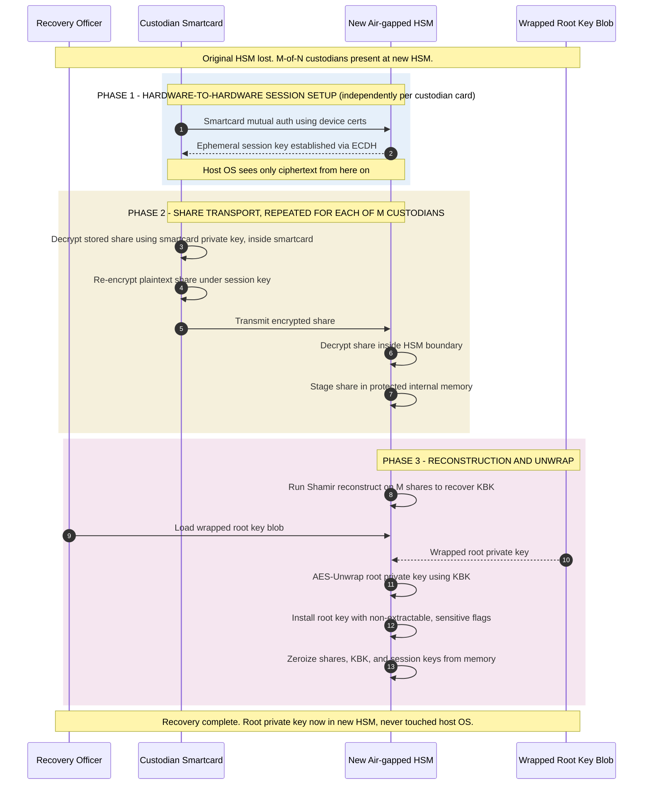

*Builds on: §4.3 Backup with Shamir.*

## The mental model

The original HSM is gone — fire, flood, theft, hardware failure, vendor exit. The wrapped root key blob still exists in backup storage. M-of-N custodian smartcards still exist. You need to reconstruct the root key inside a new HSM.

The recovery procedure is the mirror image of the backup procedure, with one extra step: establishing a secure channel between each smartcard and the new HSM.

## The recovery flow

## Walkthrough

### Phase 1 — Hardware-to-hardware session

The plaintext shares must transit from smartcards to the new HSM. They can't travel in plaintext because the host OS between them is untrusted. So each smartcard and the new HSM perform a mutually authenticated key exchange — usually ephemeral ECDH using their respective device certificates — establishing a session key only they know. From this point forward, the host OS sees only ciphertext.

### Phase 2 — Share transport, repeated M times

For each of M custodians:

1. Smartcard decrypts its stored share using its own private key. The plaintext share now exists inside the smartcard's hardware boundary.
2. Smartcard encrypts the plaintext share under the session key it just established with the HSM.
3. The encrypted share travels through host OS to the HSM.
4. HSM decrypts using the session key. Plaintext share now exists inside HSM's hardware boundary.

### Phase 3 — Reconstruction and unwrap

The HSM now has M plaintext shares in its internal memory. It runs Shamir reconstruction — Lagrange interpolation on the M points — recovering the original KBK polynomial's constant term. The plaintext KBK now exists inside the HSM.

The officer loads the wrapped root key blob from backup storage. The HSM uses the recovered KBK to unwrap the blob, producing the original root private key. The HSM installs the key with the same `CKA_EXTRACTABLE = FALSE` property as the original.

Finally, all ephemeral material — the shares, the reconstructed KBK, the session keys — is zeroized from HSM memory. Only the recovered root key remains.

## What's preserved

The recovered root key is bit-identical to the original. The public key is the same. Every previously-issued certificate signed by the old HSM still verifies under the new HSM, because the key is mathematically the same. **Recovery is transparent to the rest of the world.**

Why this is hard to attack

An attacker mounting this attack would need to compromise M custodians simultaneously, intercept smartcard-to-HSM sessions (which requires defeating both endpoints' hardware), AND obtain the wrapped blob from backup storage. Each layer requires independent compromise. Real-world attacks have always been against the operational layer — coercing custodians, social engineering — not the cryptography.

Takeaway

Recovery is backup in reverse, with hardware-to-hardware session establishment as the extra step. Plaintext key material still never exists outside hardware boundaries during the entire process.

