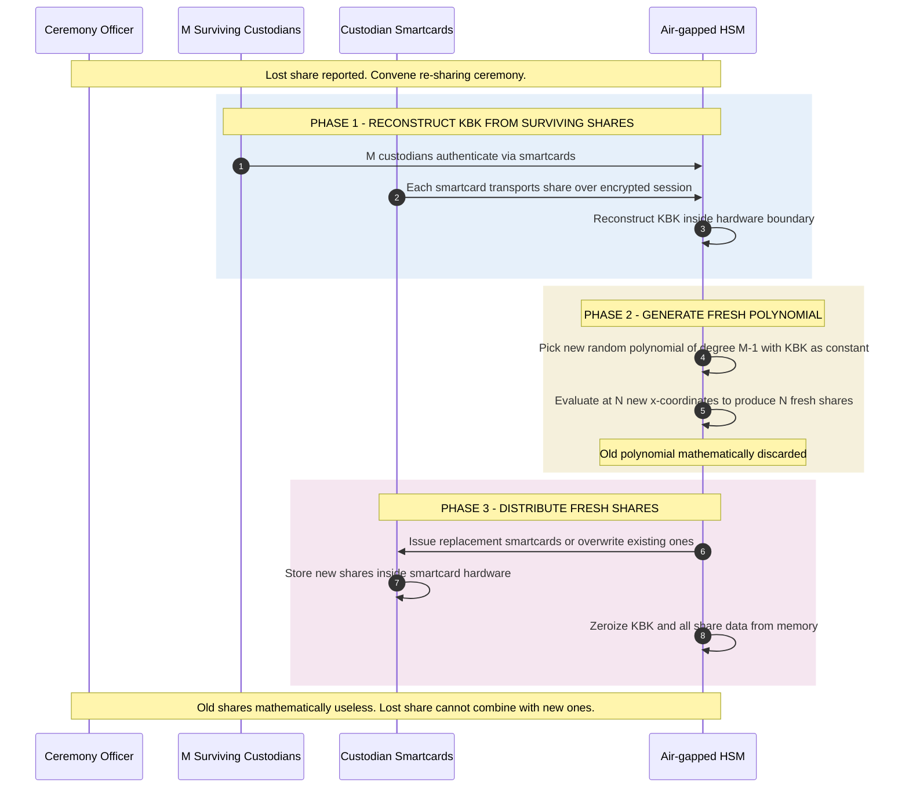

*Builds on: §4.3 Backup, §4.4 Recovery.*

## The mental model

A custodian loses their smartcard. Or quits the company. Or their card is compromised. You need to retire the old share without changing the root key itself. The naive response — "just reissue at the same polynomial" — is mathematically valid but security-wrong.

The correct response is **proactive re-sharing**: generate an entirely new polynomial, producing N fresh shares, retiring all old shares as mathematically useless.

## Why same-polynomial reissue is wrong

If you have M valid shares, you can reconstruct the polynomial and evaluate it at a new x-coordinate to produce a replacement share. Mathematically this works. Security-wise it doesn't:

- The lost share is still out there somewhere
- If an attacker recovers it, they have one share toward the threshold
- They only need M-1 more custodians compromised instead of M
- You've quietly reduced the security margin of the scheme

## What re-sharing does

Re-sharing generates a **new polynomial** with the same constant term (the KBK or whatever secret is being protected). The new polynomial is mathematically unrelated to the old one. New shares from the new polynomial cannot combine with old shares.

- Lost share becomes worthless even if recovered
- All custodians get new shares, not just the one who lost theirs
- The KBK itself remains unchanged — wrapped root key blob is still valid

## The re-sharing flow

## The bonus property — proactive refresh

Once you have re-sharing as a capability, you can use it preventively. **Periodic share rotation** — every 6-12 months, say — invalidates any shares an attacker may have quietly accumulated over time.

The threat model this defends against is the slow attacker: someone compromising custodians one at a time over years, collecting shares, waiting until they have M. With proactive refresh, every refresh window resets the attacker's progress to zero. They must compromise M custodians within a single refresh window.

This concept comes from the academic literature on **proactive secret sharing** (Herzberg, Jarecki, Krawczyk, and Yung, CRYPTO 1995). For high-value roots that need to last decades, periodic refresh is standard hygiene.

## What if too many custodians are unavailable

The catastrophic case

If fewer than M custodians can participate, you cannot reconstruct the KBK. You cannot re-share. The wrapped root key backup becomes permanently unrecoverable. This is why N is chosen with margin — a scheme tolerates N−M lost shares before recovery becomes impossible, so a 3-of-5 scheme survives 2 losses and a 3-of-7 scheme survives 4. The tradeoff is operational cost: more custodians means more logistics for every ceremony. For multi-decade roots, the resilience matters more than the convenience.

## What to remember for high-assurance design

- Lost share → re-share, don't reissue
- Re-sharing changes shares but not the underlying key
- Re-sharing requires M surviving custodians to authorize
- Schedule proactive refresh for high-value roots, not just reactive
- Choose N with enough margin to survive realistic loss rates

Takeaway

Re-sharing rotates the share material without rotating the underlying key. It's the recovery procedure run in reverse, then in forward — reconstruct the secret, generate a new polynomial, distribute new shares, retire old ones.

