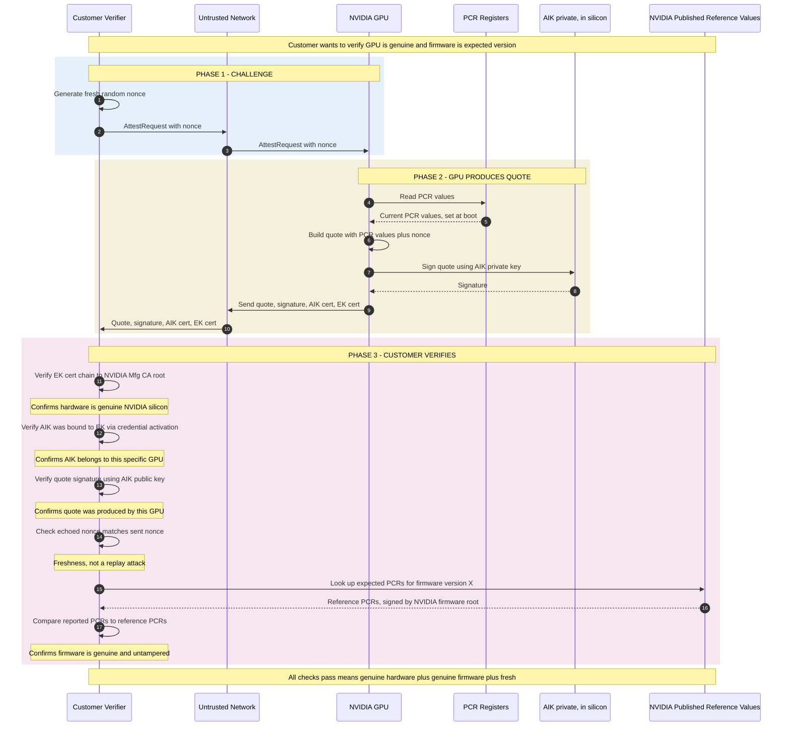
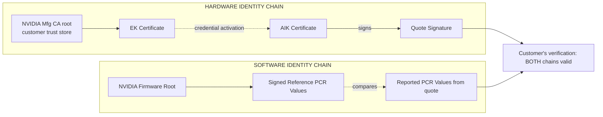

*Builds on: §3.6 EK/AIK, §3.5 Measured boot.*

## The mental model

A customer wants to know two things about a remote device:

1. Is this genuine hardware from the expected vendor?
2. Is the software running on it genuine and untampered?

Remote attestation answers both with one round trip. The device produces a signed statement combining hardware identity (EK/AIK chain) and software measurements (PCR values). The customer verifies the chain and compares measurements to published reference values.

## The full flow

## The four things being proven

### 1. The signer is a genuine GPU

EK certificate chain to manufacturer's CA root. The cert says "this EK belongs to GPU serial #XYZ, certified by NVIDIA." Customer verifies using NVIDIA's Manufacturing CA root in their trust store. Identical to standard X.509 verification, except the subject is hardware.

### 2. The AIK belongs to this GPU

The AIK is **bound to the EK via credential activation**, not by an EK signature — the EK is a decryption key, so it can't sign. The manufacturer's CA issues the AIK certificate only after encrypting a challenge to the EK's public key and confirming the chip can decrypt it; that proves the AIK and the certified EK live in the same GPU. The two-layer indirection is also for privacy — the EK isn't exposed directly. The customer trusts the AIK certificate because it chains to the manufacturer CA from step 1.

### 3. The quote is fresh and from this GPU

Signature on the quote verified using AIK pubkey, plus nonce match. Without the nonce, an attacker could capture a legitimate quote once and replay it. With the nonce, every quote is tied to a specific challenge.

### 4. The firmware is the expected version

Comparison of reported PCRs to NVIDIA's published reference values for the expected firmware version. The reference values are signed by NVIDIA's firmware signing root (a different root from the manufacturing CA). The customer trusts two NVIDIA-rooted assertions: hardware is real (via Mfg CA), firmware is expected (via Firmware CA).

## The two trust chains meeting

## Why this is the foundation of confidential computing

When a customer rents an NVIDIA GPU in the cloud, they want:

- Cryptographic assurance the actual physical hardware is real NVIDIA silicon, not a simulator
- Cryptographic assurance the firmware is the published version, not a malicious variant
- Assurance is current, not a recording from yesterday

Remote attestation provides all of this. The customer trusts NVIDIA + cryptographic math, not the cloud provider in between.

The role of the Manufacturing CA's public certificate

NVIDIA's Manufacturing CA private key never leaves NVIDIA's HSMs. But the corresponding public certificate must be widely distributed — customers need it to verify the EK cert chain. Publication happens via developer docs, driver bundles, SDK distributions, and trust store integrations. Just like every other PKI: private key locked away, public certificate freely distributable.

Takeaway

Remote attestation is two trust chains — hardware identity and software identity — meeting in the customer's verifier. The cryptography binds them together with a fresh nonce. The customer ends up trusting NVIDIA's CAs and the math, not any intermediary.

