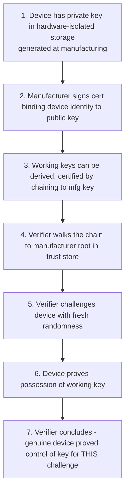

*Builds on: §5.1 Remote attestation.*

## The mental model

Once you understand remote attestation, you see the same pattern everywhere. It's not specific to NVIDIA GPUs or TPMs — it's a universal construction that recurs across every modern security protocol.

The pattern in one sentence: **a device has a private key in hardware-isolated storage, the manufacturer certifies that key, and the device proves possession of the key in response to a fresh challenge from a verifier.**

## The seven-step pattern

## Where this pattern appears

| System | What's attested | Hardware identity | Verifier |
| --- | --- | --- | --- |
| NVIDIA GPU attestation | Hardware + firmware | GPU EK | Cloud customer |
| TPM remote attestation | Server boot state | TPM EK | Fleet management |
| WebAuthn / FIDO2 enrollment | Authenticator is genuine | Authenticator attestation key | Relying Party server |
| Apple App Attest | iOS app on genuine Apple device | Per-app Secure Enclave key, attested by Apple (distinct from the DeviceCheck API) | App backend server |
| Google Play Integrity | Android app on uncompromised device | Google-signed *verdict* (server-mediated; not a device-key cert chain the verifier walks) | App backend server |
| Intel SGX attestation | Enclave running expected code | SGX provisioning key | Remote relying party |
| AMD SEV-SNP attestation | VM running in encrypted memory | AMD platform key | VM customer |
| AWS Nitro Enclave attestation | Workload in Nitro enclave | Nitro attestation key | AWS customer |
| Sigstore Fulcio identity | OIDC token holder | OIDC IdP signing key | Sigstore verifier |
| mTLS in zero-trust networks | Workload identity | Workload attestation key | Service mesh peer |

## What varies and what doesn't

The variations are:

- **What's being attested** — a device, a TEE, a workload, a user, a piece of code
- **Where the key lives** — silicon, secure enclave, smartcard, TPM, in-memory
- **Who's verifying** — cloud customer, RP server, TLS peer, mesh sidecar
- **Privacy posture** — per-device unique vs per-batch shared keys

The cryptographic construction stays the same.

## Privacy variations: per-device vs per-batch keys

The choice matters. Two extremes:

- **Per-device unique attestation keys** — strongest identity, weakest privacy. Each device is individually identifiable. Used in NVIDIA GPU attestation (cloud customer already knows which GPU they rented), enterprise device management, automotive identity.
- **Per-batch shared attestation keys** — same attestation key shared across 100,000+ devices in a manufacturing batch. Verifier can confirm "this is a genuine Apple device" but cannot uniquely identify which one. Used in Apple's consumer WebAuthn attestation, FIDO Alliance basic attestation, anti-correlation deployments.

NVIDIA's model is the per-device variant. Apple's consumer model is the per-batch variant. Same cryptography, different privacy tradeoffs driven by use case.

## Side-channel reality

Most TEEs have faced serious side-channel breaks

Hardware-attestation systems are under constant side-channel research. Intel SGX has been broken multiple times (Foreshadow, MDS, ZombieLoad); AMD SEV-SNP has too (CacheWarp, Cipherleaks). These are largely transient-execution / side-channel attacks, usually patched via microcode or firmware. Not every TEE has an equivalent public break, and designs differ in attack surface (e.g. AWS Nitro and Intel TDX take different approaches). The recurring pattern: vendor ships, researchers find side channels, vendor patches, new attacks emerge — confidential-computing customers are betting the vendor patches faster than attackers find new holes.

Takeaway

Once you see the attestation pattern, you see it everywhere. The cryptographic construction is universal — fresh challenge, proof of possession via hardware-protected key, verifier walks chain to manufacturer root. The protocols differ only in surface details.

