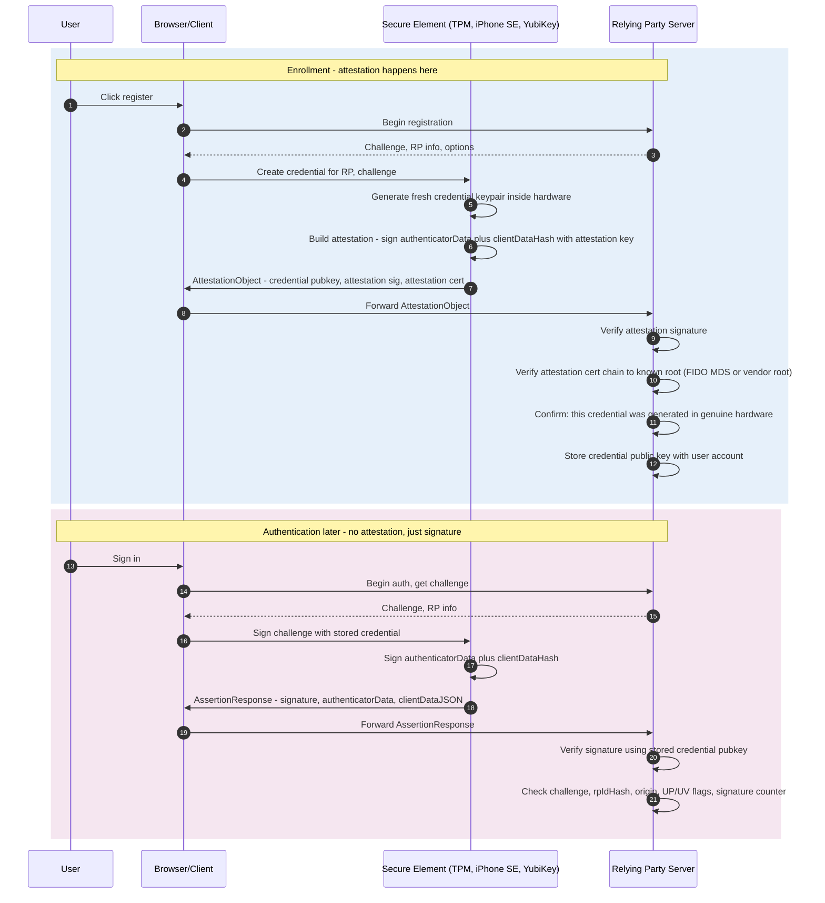

*Builds on: §5.2 The universal attestation pattern.*

## The mental model

WebAuthn is the universal attestation pattern applied to user authenticators (YubiKeys, platform authenticators in phones, TPM-backed credentials). When you register a passkey, the authenticator attests that the credential was generated inside genuine hardware, signed by the manufacturer's CA.

The key insight: **passkey enrollment IS hardware attestation, just applied to a different artifact (a user credential rather than a firmware measurement).**

## Two distinct flows often confused

WebAuthn has two flows that often get conflated. They run at different times:

- **Enrollment** — attestation happens. Authenticator proves its hardware authenticity. Only happens once per credential.
- **Authentication** — no attestation. Just signature with the credential key. Happens every login.

## Enrollment — where attestation lives

## Walkthrough

### Enrollment phase

**1–3.** User initiates registration. RP sends a challenge.

**4–5.** Browser asks the secure element to create a credential. The SE generates a fresh keypair inside its hardware boundary. The private key never leaves.

**6.** The SE builds an attestation: it signs over the **authenticatorData** (which *contains* the new credential public key) concatenated with the **client-data hash** (which binds the RP's challenge and origin), using its *attestation key*. The attestation key is a separate, manufacturer-controlled key — the analog of the EK in TPM language.

**7–9.** Browser forwards the attestation object to the RP. The RP verifies:

- The attestation signature using the attestation public key from the included cert
- The attestation cert chain back to a trusted root (FIDO Metadata Service, or vendor-published roots)

**10.** RP now trusts that the credential was generated inside genuine hardware. Stores the credential public key.

### Authentication phase (later)

No attestation. The user signs in by signing the authenticator data plus the client-data hash with the stored credential key. The RP verifies the signature with the credential public key from enrollment, and also checks: the **challenge** it issued, that the **rpIdHash** matches the expected RP ID, that the **origin** in the client data is expected, that the **user-presence / user-verification flags** are set, and that the **signature counter** advanced. The browser enforces the origin↔RP-ID binding — that's what makes passkeys phishing-resistant. **One-time hardware authentication at enrollment, fast signature verification on every use.**

## Side-by-side with NVIDIA attestation

The structural parallel is close — same shape, one deliberate privacy difference:

| Element | NVIDIA GPU | Apple Passkey |
| --- | --- | --- |
| Permanent device identity | EK (Endorsement Key) | Per-model attestation key |
| Working key | AIK (per-context) | Per-credential keypair |
| Working key cert | AIK bound to EK via credential activation | Implicit (attestation signs credential pubkey directly) |
| Permanent identity cert | EK cert signed by NVIDIA Mfg CA | Attestation cert signed by Apple WebAuthn CA |
| Root | NVIDIA Manufacturing CA | Apple WebAuthn Attestation Root |
| Verifier | Cloud customer | Relying Party server |
| Trust store source | NVIDIA-published cert | FIDO MDS or Apple-published cert |

The one deliberate difference

A GPU uses a <strong>per-device</strong> identity (the EK). Consumer WebAuthn deliberately does <em>not</em>: it uses a <strong>batch</strong> attestation key shared across many devices — or no attestation at all — because a per-device key would be a cross-site tracking vector. So the pattern is the same, but the device-uniqueness is intentionally inverted.

## WebAuthn attestation: two different axes

People conflate two separate things here. They are different axes:

**Conveyance preference** — what the RP *asks* for (the `attestation` option):

- **none** — RP doesn't want attestation (the client may strip it)
- **indirect** — attestation allowed, possibly anonymized by the client/CA
- **direct** — RP wants the authenticator's attestation as-is
- **enterprise** — individually-identifying attestation, only for managed devices

**Attestation type** — what the statement actually *is*:

- **None** — no attestation; self-asserted only
- **Self** — signed with the credential key itself; proves consistency, not manufacturer authenticity
- **Basic** — a per-batch attestation key shared across many devices (typically 100,000+), so it can't fingerprint one device; the consumer default
- **AttCA** — attestation via a CA inside the authenticator (TPM-style)
- **AnonCA** — an anonymization CA issues per-credential anonymized certs

For consumer passkeys, `none`/`indirect` conveyance with Basic/no attestation is standard; enterprise deployments use `enterprise` conveyance for stronger device identity. Same protocol, different privacy posture.

Takeaway

WebAuthn enrollment IS hardware attestation, applied to user credentials. The construction mirrors NVIDIA GPU attestation — fresh challenge, proof of possession via a hardware-isolated key, cert chain to a vendor root. The deliberate difference is privacy: consumer WebAuthn avoids a per-device identity, using batch keys (or none) so you can't be tracked across sites.

