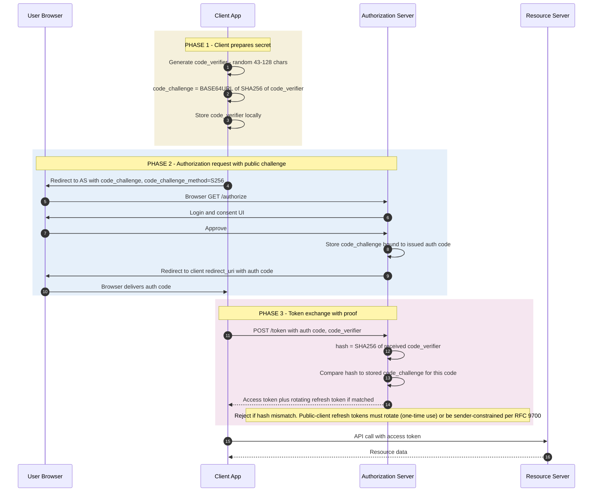

*Builds on: §1.1 Signing & verification.*

## The mental model

OAuth 2.0's authorization code flow has a classic vulnerability: the authorization code travels through the user's browser. If an attacker can intercept that code (malicious app, browser extension, network observer in some contexts), they can exchange it at the token endpoint and impersonate the user.

PKCE (Proof Key for Code Exchange, RFC 7636) fixes this by binding the code to a secret only the legitimate client knows. Stealing the code becomes useless without the secret. For a **confidential** client the stolen code alone already isn't enough (the attacker also needs the client secret) — so there PKCE's added value is defeating **authorization-code injection**, where an attacker injects a code they obtained into *their own* session. That's why RFC 9700 now mandates PKCE for *every* OAuth flow, not just public clients.

## The three values

- **code\_verifier** — a high-entropy random string (at least 256 bits / 32 bytes, base64url-encoded → 43–128 characters), generated by the client at the start of the flow
- **code\_challenge** — `BASE64URL(SHA256(code_verifier))`. Derived from the verifier, sent to the authorization server with the initial request
- **code\_challenge\_method** — almost always `S256` (SHA-256). A `plain` method exists (where `code_challenge == code_verifier`) but should not be used: if the authorization request is intercepted, the attacker sees the verifier directly and PKCE collapses. `S256` sends only the hash, so the verifier stays secret — and RFC 7636 requires servers that support S256 to reject a downgrade to `plain`

The verifier is the secret. The challenge is the public commitment to that secret. Standard hash-based commitment scheme.

## The flow

## Walkthrough

**Phase 1 — Client prepares.** Before initiating the flow, the client generates a fresh random `code_verifier` and computes `code_challenge = BASE64URL(SHA256(verifier))`. The verifier is stored locally (memory, sessionStorage, etc.) for use in the token exchange step.

**Phase 2 — Authorization with public challenge.** Client redirects user to AS, sending `code_challenge` in the URL. AS stores the challenge bound to the auth code it issues. Auth code returns to the client via redirect.

**Phase 3 — Token exchange with proof.** Client posts to `/token` with both the auth code AND the original `code_verifier`. AS hashes the received verifier, compares to the stored challenge. Match = trust that this is the same client that started the flow. Mismatch = reject.

## What this defends against

| Attack | Without PKCE | With PKCE |
| --- | --- | --- |
| Auth code interception | Attacker exchanges intercepted code at token endpoint, gets tokens | Attacker has code but not verifier. Token endpoint rejects. |
| Malicious app on same device | Could register custom URI scheme to receive codes | Codes are useless to the malicious app without legitimate client's verifier |
| Code leakage via referrer/logs | Catastrophic — leaked code = full access | Leaked code is useless without verifier |

## Why hash commitment, not just sending a secret

Couldn't the client just send a shared secret to the AS at the token endpoint? Yes — that's what client\_secret does for confidential clients. But:

- Public clients (SPAs, mobile apps) can't hold a client\_secret securely
- Even if they could, the same secret reused across all flows can be exfiltrated

PKCE uses a fresh per-flow secret. The hash commitment binds the secret to a specific auth request without revealing the secret in transit.

## When it's required

RFC 9700 (OAuth 2.0 Security Best Current Practice, 2024) mandates PKCE for **all** OAuth 2.0 authorization code flows — public AND confidential clients. The historical "PKCE is only for public clients" guidance is obsolete.

How PKCE fits the broader theme

PKCE is another instance of 'proof of possession.' The client commits to a secret (challenge), uses the secret later (verifier) to prove it controlled the flow from beginning. Same pattern as WebAuthn, DPoP, attestation — bind an artifact to possession of a specific key or secret.

Takeaway

PKCE binds an OAuth auth code to a secret only the legitimate client knows. Intercepted codes become useless. The pattern — hash commitment of a per-flow secret — appears throughout modern crypto protocols.

