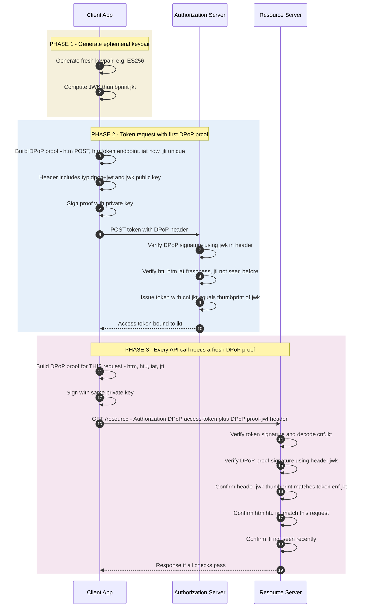

*Builds on: §6.1 PKCE.*

## The mental model

An OAuth bearer token is a bearer instrument — whoever holds it can use it. If a token leaks (logs, XSS, proxy compromise), the attacker has the same access as the legitimate client. DPoP (Demonstrating Proof of Possession, RFC 9449) binds tokens to a cryptographic keypair so a stolen token alone is insufficient.

Every API request must be accompanied by a fresh **DPoP proof JWT** signed by a private key only the legitimate client holds. The access token contains a thumbprint of the public key. Steal the token, you still don't have the private key, and you can't forge proofs.

## The construction

- **Client keypair** — generated and held locally by the client. It must persist as long as the tokens bound to it are in use (often the session) — it does *not* need to be regenerated per request, just kept client-side and never exported.
- **DPoP proof JWT** — signed by client's private key per request. Header carries the public key; claims tie the proof to a specific HTTP method, URI, and timestamp.
- **Access token with cnf claim** — the AS issues a token whose `cnf.jkt` (confirmation thumbprint) is the JWK thumbprint of the client's public key.

## The flow

## What gets verified per request

Every protected resource server check:

1. Access token is valid (signature if it's a JWT, or token introspection if it's opaque), not expired, not revoked. Note the token is sent with the `DPoP` auth scheme — `Authorization: DPoP <access_token>` — not `Bearer`, with the proof in a separate `DPoP:` header
2. DPoP proof JWT signature valid using public key in its header
3. Header public key's thumbprint equals `cnf.jkt` in token
4. `htm` claim matches request HTTP method
5. `htu` claim matches request URI
6. `iat` within acceptable freshness window (typical 60-300 seconds)
7. `jti` not in replay cache (per-resource-server)

All seven checks must pass. Any failure rejects the request.

## What this defends against

| Attack | Without DPoP | With DPoP |
| --- | --- | --- |
| Token leak via logs | Attacker uses token until expiry, full access | Attacker has token but not key, cannot forge proofs |
| Token theft via XSS | Token exfiltrated, used remotely | Key never leaves client; only proofs leak, each tied to one request |
| Compromised proxy | Sees token, replays at will | Sees proof for ONE request, cannot reuse for others |
| Token replay | Token usable until expiry | jti tracking blocks replay; htu/htm bind to specific request |

## How this connects to mTLS-bound tokens

RFC 8705 (OAuth 2.0 Mutual TLS) is the older mechanism for sender-constrained tokens. The TLS client certificate binds the token; resource server verifies the connection's TLS cert matches the cert in the token's `cnf` claim.

DPoP is the application-layer alternative: instead of requiring mTLS infrastructure, the binding happens in JWT signatures. Lighter weight, works through proxies and CDNs, but more complex application logic. Both achieve sender-constrained tokens: DPoP is easier to deploy (no client-certificate infrastructure), while mTLS-bound tokens are generally considered stronger where the infrastructure exists and are preferred in high-assurance profiles like FAPI.

The replay window — and the nonce that closes it

DPoP proofs carry <code>iat</code> (issued-at); time-window freshness is the common pattern (often 60–300s), but it's a weak control on its own. RFC 9449 also defines a server-supplied <strong>nonce</strong>: the AS/RS can return a <code>DPoP-Nonce</code> header and require the client to echo it in the next proof. That eliminates reliance on loose clocks and blocks pre-generated proofs — <code>jti</code> tracking plus a server nonce is the strong configuration.

Takeaway

DPoP binds OAuth tokens to a client-controlled keypair via signed proofs of possession per request. Stolen tokens are useless without the key; replayed proofs are useless because each is tied to a specific request and timestamp.

