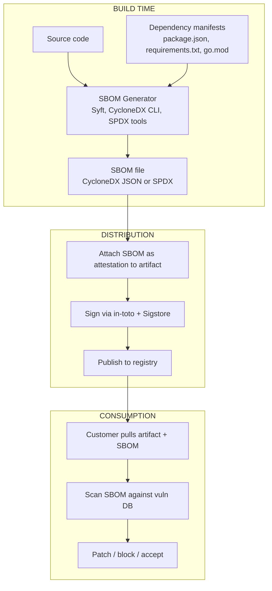

*Builds on: §1.1 Signing & verification.*

## The mental model

SBOM (Software Bill of Materials) is the ingredient list for a piece of software. Same idea as a food label: declare what's inside, in what quantity, from where, with what known properties. Without an SBOM, when a new CVE drops, you can't answer "are we affected?" except by emergency manual audit.

Two competing standards, both supported across the industry: **CycloneDX** (OWASP, JSON-first, security-focused) and **SPDX** (Linux Foundation, license-focused). Tools usually generate both.

## What's in an SBOM

A minimal SBOM lists, for each component:

- **Name and version** — `log4j-core 2.14.1`
- **Hash / digest** — SHA-256 of the artifact; the integrity anchor used to verify a component is bit-for-bit what's claimed
- **Supplier / origin** — Maven Central, npm, GitHub
- **License** — Apache 2.0, MIT, GPL, etc.
- **Dependencies** — what this component itself depends on
- **PURL or CPE** — Package URL or Common Platform Enumeration, for consistent *naming and matching* of components across systems (the hash, not the PURL/CPE, is what's bit-for-bit unique)

The hash matters more than the version — versions can be relabeled. But a hash isn't magic: an attacker who controls the SBOM can write any hash they like. It only means something once the SBOM is **signed by a party you trust** *and* you **recompute the hash against the real artifact**. Then a silently-swapped component is detectable.

## How SBOMs are produced and consumed

## The vulnerability response use case

The killer application for SBOMs: vulnerability response.

**Before SBOM:** CVE-2021-44228 (Log4Shell) drops. Every organization spends days running grep across codebases, asking vendors questionnaires, manually inventorying systems.

**With SBOM:** CVE drops with affected package + version range. Automated systems query SBOM database: "any artifact containing log4j-core in 2.0-2.14.x?" Answer in seconds. Patch in hours, not weeks.

## SBOM in regulated environments

Multiple government mandates now require SBOMs:

- **US EO 14028** (2021) — Federal software acquisitions require SBOMs
- **EU Cyber Resilience Act** (2024) — SBOM required for products with digital components
- **FDA** — Medical device software regulation includes SBOM requirements
- **UK Cyber Security and Resilience Bill** — extending to critical infrastructure

SBOMs went from "good practice" to "required" in about 3 years.

## What SBOM does NOT solve

SBOM is a description, not an attestation. By itself, an SBOM doesn't prove:

- The SBOM accurately reflects what's in the artifact
- The artifact was built with a trustworthy process
- The build was not tampered with
- The listed components are themselves trustworthy

That's why SBOMs are typically wrapped in signed in-toto attestations and combined with SLSA provenance. SBOM = what's inside. SLSA = how it was made. Together they form supply chain integrity.

The SolarWinds precedent

The 2020 SolarWinds Orion compromise was exactly the failure mode SBOMs are designed to detect. Malicious code was inserted in the build pipeline. Without SBOM + build provenance, downstream consumers had no way to detect that the binary they ran wasn't the binary that should have been produced from the source. This single incident drove much of the regulatory push toward SBOM mandates.

Takeaway

SBOM is the ingredient list — necessary for vulnerability response, required by emerging regulation, but only one piece of supply chain integrity. It tells you what's inside; SLSA tells you how it got there.

