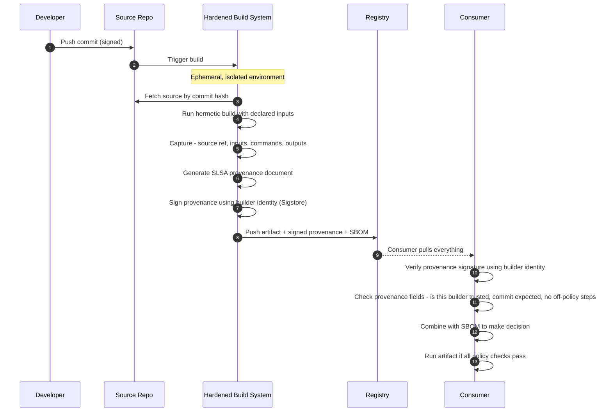

*Builds on: §7.1 SBOM.*

## The mental model

If SBOM is "what's inside," SLSA (Supply-chain Levels for Software Artifacts, pronounced "salsa") is "how it was made." SLSA defines maturity levels for build pipelines — how trustworthy is the process that produced this artifact?

It started at Google, was donated to the Open Source Security Foundation (OpenSSF), and is now the de facto standard for build pipeline assurance.

## The SLSA build levels (v1.0)

| Level | What it requires | Defends against |
| --- | --- | --- |
| **Build L1** | Build produces provenance describing how the artifact was made | Mistakes and unintentional drift |
| **Build L2** | Build runs on a hosted platform that generates and **signs** provenance | Tampering with provenance after the build |
| **Build L3** | Hardened, isolated builds; provenance is **non-falsifiable** and signing material is unreachable from user-defined build steps | Tampering during the build, or by other tenants on the platform |

Most production pipelines target L2 or L3.

SLSA versions

SLSA <strong>v1.0</strong> (2023, the current standard that GitHub and npm provenance target) reorganized the spec into <em>tracks</em>; the Build track tops out at <strong>L3</strong>. The earlier <strong>v0.1</strong> draft had an L4 (two-party review plus hermetic, reproducible builds) — v1.0 removed it, and those properties are expected to return in separate, emerging tracks. If you see a four-level L1–L4 ladder, it is the deprecated v0.1 model.

## The core artifact: provenance

SLSA produces a **provenance** document for every build. It declares:

- **Subject** — what was built (digests of output artifacts)
- **Builder** — what platform built it (GitHub Actions runner ID, GCB job ID)
- **Source** — what source was used (Git commit hash)
- **Dependencies** — what inputs were pulled in
- **Build configuration** — exact commands, parameters, environment
- **Materials** — anything else that influenced the output

The provenance is signed by the builder — non-falsifiable if the builder itself is trustworthy.

## The build pipeline with SLSA

## Walkthrough

**1–2.** Developer commits to source. Signed commits (using Git's SSH/GPG/Sigstore signing) tie the change to a specific identity.

**3–4.** Build triggers. Hardened build platforms (GitHub Actions with SLSA generators, Google Cloud Build, custom runners) provide ephemeral environments — every build starts from scratch, no persistent state, no cross-build contamination.

**5–6.** Build runs hermetically: only declared inputs are accessible, no arbitrary network access. Anything that influences the output is captured and recorded.

**7–8.** SLSA provenance generated and signed by the build platform's identity. The signature is unforgeable as long as the build platform itself is uncompromised.

**9–13.** Consumer pulls artifact + provenance + SBOM. Verification checks:

- Is the provenance signed by a trusted builder?
- Does the provenance source commit match what was expected (e.g., a tagged release in the upstream repo)?
- Were any unexpected steps performed?
- Does the SBOM list any components with known critical CVEs?

## How SLSA relates to existing systems

| System | SLSA level achievable |
| --- | --- |
| Manual builds on developer laptop | L0 / L1 if process is documented |
| GitHub Actions with default config | L2 reachable, depends on workflow |
| GitHub Actions with SLSA generator + hermetic builds | L3 reachable |
| Google Cloud Build, Tekton with security hardening | L2-L3 |
| Bazel hermetic/reproducible builds on a hardened, isolated runner | Build L3 |

## The combination that matters

SBOM + SLSA together

SBOM tells you 'log4j-core 2.14.1 is inside this artifact.' SLSA tells you 'this artifact was built from commit abc123 by GitHub Actions on June 1, with no off-policy steps.' Together: 'I'm running the right code, built from the right source, by the right pipeline.' That's supply chain integrity in three sentences.

Takeaway

SLSA describes how an artifact was built. The build levels (L1–L3) correspond to increasing isolation, automation, and provenance integrity. Provenance documents signed by the builder are non-falsifiable proof of the build process — but only as trustworthy as the builder itself.

