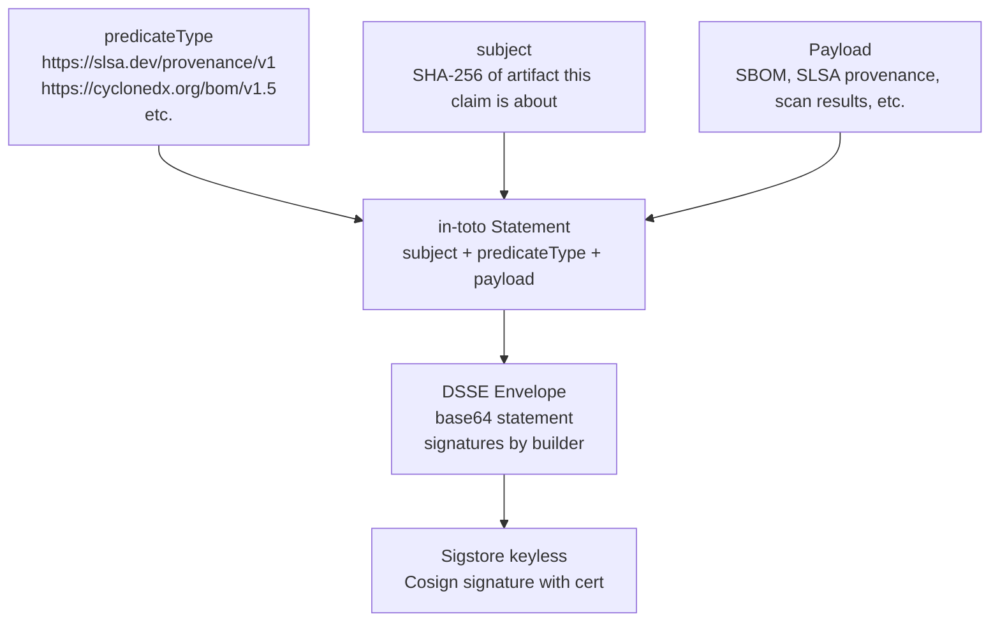
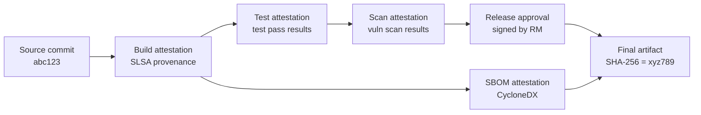
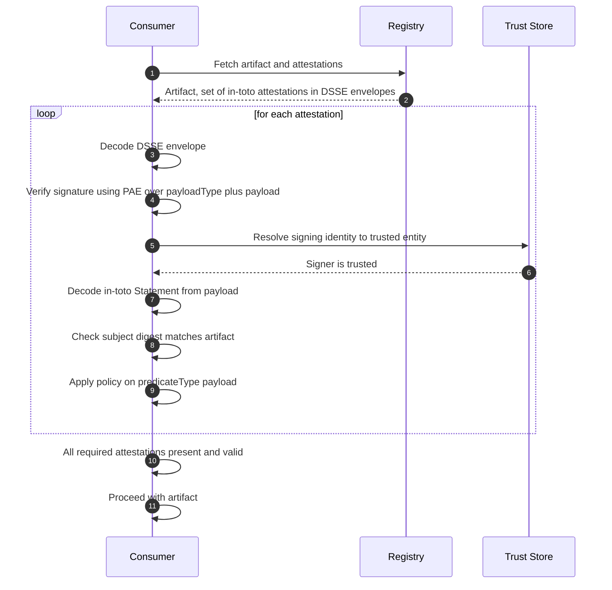

*Builds on: §7.1 SBOM, §7.2 SLSA.*

## The mental model

SBOMs and SLSA provenance are JSON documents. By themselves, they're not signed; anyone could create or modify them. To make them tamper-evident, they need a signed envelope. That envelope is the **in-toto attestation** with a **DSSE** (Dead Simple Signing Envelope) wrapper.

Think of in-toto as the universal "signed claim" format. The payload can be anything — SBOM, SLSA provenance, vulnerability scan results, test results, code review approvals. The envelope provides cryptographic integrity.

## The structure



## The wire format

A DSSE-wrapped in-toto attestation looks like:

```
{
  "payloadType": "application/vnd.in-toto+json",
  "payload": "base64-encoded in-toto Statement",
  "signatures": [
    {
      "keyid": "...",
      "sig": "base64 signature over PAE(payloadType, payload)"
    }
  ]
}
```

The signature covers a deterministic encoding called PAE (Pre-Authentication Encoding) of the payload type and payload. PAE prevents signature confusion across different payload types.

## Why a separate envelope

It's tempting to just sign the JSON directly. Why introduce a wrapper?

- **Multiple signatures** — DSSE accepts more than one signature over the same statement; useful during PQC migration, where you can attach both an ECDSA and an ML-DSA signature so verifiers on either scheme can validate. (DSSE itself does no algorithm *negotiation* — verifiers must know out-of-band which keyid maps to which algorithm)
- **Domain separation** — PAE ensures a signature on an SBOM cannot be confused with a signature on a SLSA provenance
- **Standardization** — every tool emits the same envelope format, simplifying verification
- **Multi-signature support** — multiple parties can co-sign (e.g., builder signature + security team signature + release manager signature)

## How in-toto attestations chain

A single artifact often has multiple attestations from different stages:



Each attestation references the artifact by its SHA-256 digest. The verifier can query all attestations for a digest and apply policy: "I require SLSA L3 provenance, a passing SBOM scan, and a release approval signed by an authorized signer." Each requirement is checked against the available attestations.

## Verification flow



## How Sigstore fits

Sigstore is the most common way to sign in-toto attestations in the open source world:

- The DSSE signature is produced by Cosign using a Sigstore ephemeral key
- The signer's identity is the Fulcio-issued cert
- The signature is logged in Rekor for transparency
- Verifiers check Fulcio cert chain to a trusted Sigstore root and verify Rekor log inclusion

This gives the best of all worlds: no long-lived keys, identity-based signing, transparent log of every attestation.

<div class="callout info"><div class="callout-label">Why this pattern keeps recurring</div><p>Generic signed-claim envelopes (DSSE, JWS, COSE, etc.) appear everywhere in modern security. They separate concerns: payload schema is one design decision; signing/integrity is another. The same DSSE envelope wraps SBOM, SLSA, scan results, code review approvals — anything that needs to be signed and verified.</p></div>

<div class="takeaway"><div class="label">Takeaway</div><p>In-toto attestations are signed claims about software artifacts, using DSSE as the universal envelope. They make SBOM, SLSA provenance, and any other claim tamper-evident and policy-evaluable. A single artifact accumulates many attestations through its lifecycle.</p></div>
