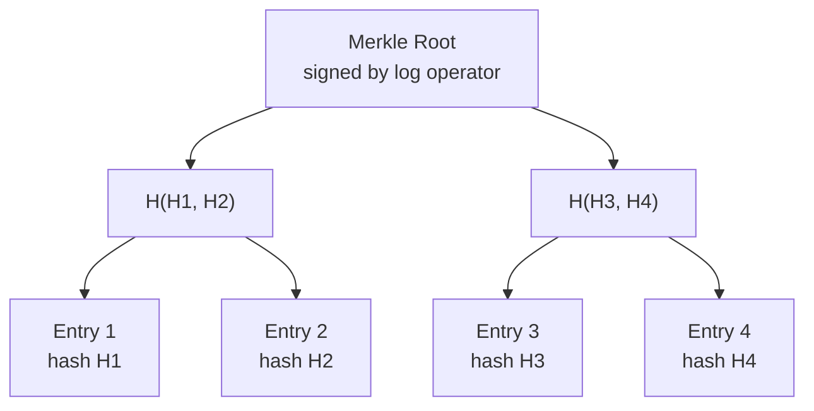
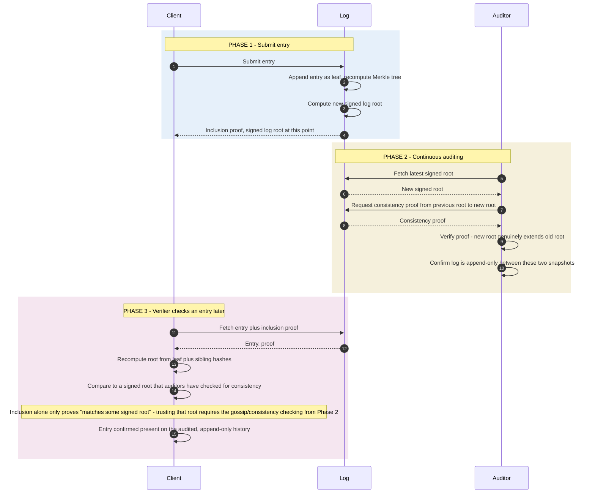

*Builds on: §1.1 Signing & verification.*

## The mental model

A transparency log is an append-only, publicly verifiable record of events. Once something is in the log, it cannot be removed, modified, or hidden — and anyone can verify both these properties cryptographically.

The technique was invented for **Certificate Transparency** in 2013, after a series of malicious CA failures (DigiNotar, etc.). It now underpins Sigstore (Rekor), npm provenance, key transparency for end-to-end encrypted messengers, and emerging AI model provenance systems.

## The core construction: Merkle trees

Every entry is a leaf in a Merkle tree. Internal nodes are hashes of their children. The root is the hash that represents the entire log state.

The log operator periodically signs the current root with a key the public knows. The signed root is the cryptographic commitment to the log's contents at that moment.

## What the log enables

| Property | How it's proven |
| --- | --- |
| Inclusion — "entry X is in the log" | Inclusion proof: a list of sibling hashes from the leaf to the root |
| Consistency — "the new log root is an extension of the old root" | Consistency proof: hashes showing the old tree is a subtree of the new tree |
| Append-only — "no entries were modified or deleted" | Consistency proofs over time prove the log only grew |
| Discoverability — "I can find all entries about X" | Log clients query and download; auditors monitor continuously |

## Inclusion and consistency proofs in detail

## Why this matters cryptographically

The cryptographic guarantee is: **the log operator cannot lie about what's in the log without being caught by independent observers.** If a log tries to:

- Remove an entry — the consistency proof fails for any continuous observer
- Modify an entry — its leaf hash changes, which changes every node on the path to the root, so the recomputed root no longer matches the previously signed root; inclusion and consistency proofs against that earlier root fail
- Hide an entry from some observers but not others (split view attack) — observers comparing notes detect the divergence

The defense is operator-independent monitoring. Anyone can run an auditor that polls the log and verifies consistency proofs. If a fork is detected, it's a major event — the operator is publicly caught misbehaving.

## Real-world transparency logs

| Log | What it records | Who runs auditors |
| --- | --- | --- |
| Certificate Transparency (CT) | Every TLS certificate ever issued by a public CA | Browser vendors, security researchers, domain owners |
| Sigstore Rekor | Signing entries and attestations (keyless and key-based) | Sigstore project, downstream verifiers, identity owners |
| npm provenance log | SLSA provenance for npm package releases | npm, GitHub, security tooling |
| Key Transparency (signal, WhatsApp) | Public key bindings for end-to-end encryption | App developers, third-party auditors |
| Binary transparency (early proposals) | Software binary releases | Software distros, package managers |

## The operator-independence property

Why transparency logs don't replace PKI

A transparency log doesn't replace the underlying signing; it adds public observability. CT logs don't issue certificates — CAs still do that. Sigstore Rekor doesn't sign artifacts — Fulcio-issued certs do. The log is the audit trail, not the trust authority. The combination — signing + transparency — is what gives the cryptographic + operational guarantee.

Takeaway

Transparency logs add public auditability on top of signing. Cryptographic operator independence — the log cannot lie without being caught — is the property that makes them powerful. They turn 'trust the operator' into 'trust the operator, but verify continuously.'

