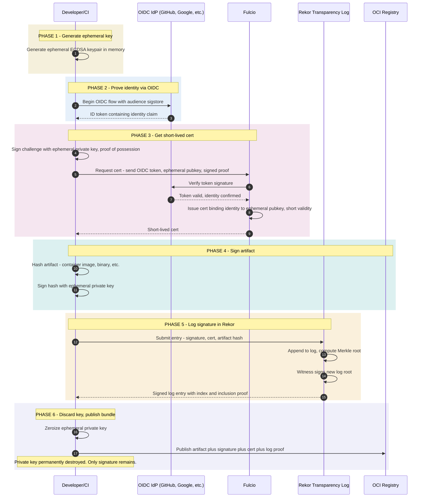
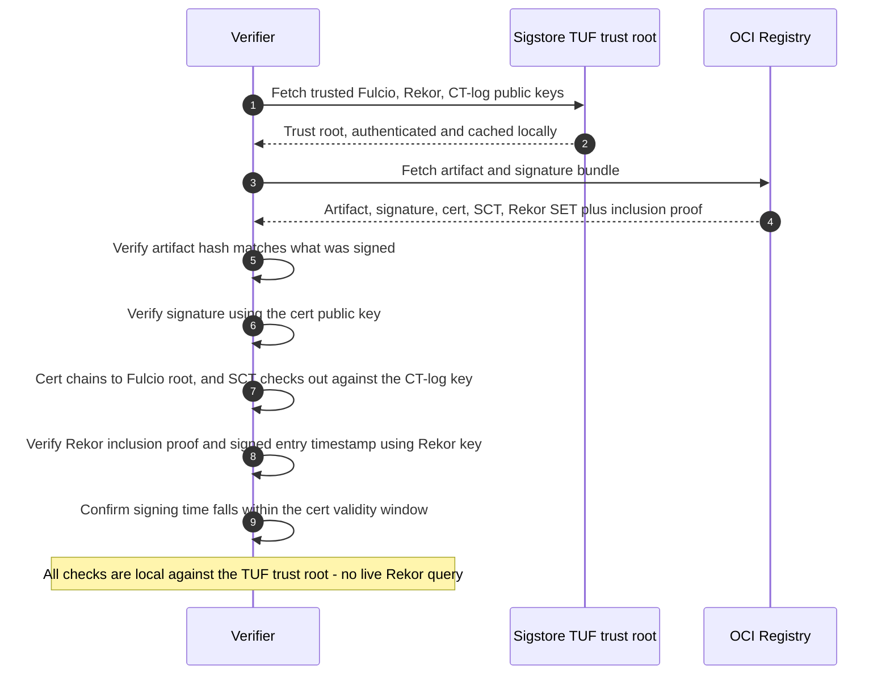

*Builds on: §7.4 Transparency logs, §2.1 Certificate issuance.*

## The mental model

The old code signing model: you have a long-lived signing key, you protect it carefully (HSM, smartcard), you sign artifacts with it. Compromise of the key compromises every artifact signed by it. The model is fragile.

Sigstore inverts this: **no long-lived keys at all.** Every signature uses a freshly-generated keypair, valid for only minutes, tied to an identity proven via OIDC. The signature is logged in a public append-only log, making it verifiable years later despite the key being long gone.

## The core components

- **Fulcio** — a CA that issues short-lived signing certificates to anyone who can prove an identity via OIDC
- **Rekor** — an append-only transparency log that records each signature and its certificate, so it stays verifiable after the cert expires
- **The TUF-distributed trust root** — an authenticated bundle of the Fulcio, Rekor, and CT-log public keys, delivered via [The Update Framework](https://theupdateframework.io/), so verifiers can trust all of the above **offline**

Fulcio also logs every certificate it issues to a **Certificate Transparency (CT) log**, and the cert carries a signed certificate timestamp (SCT) — that's how rogue cert issuance gets detected.

**Cosign** is the most common client tool that drives this flow, but it's just one client (`sigstore-go`, `sigstore-python`, `gitsign`, GitHub Actions, and others do the same) — not a core component of the trust architecture.

## The keyless signing flow

## How verification works years later

The signing cert expired 10 minutes after issuance. The private key was destroyed long ago. Yet the signature must remain verifiable. How?

Verification is **offline** — the verifier never queries the live Rekor log. Everything it needs (the cert, the SCT, and Rekor's signed entry timestamp + inclusion proof) ships in the signature *bundle*, and it's checked against the public keys in the TUF trust root.

(Querying Rekor at verification time is possible for monitoring, but it is not the standard verification path.)

## The crucial insight: Rekor as timestamp

Rekor's **signed entry timestamp** anchors *when* the signature was logged: "this signature, by this cert, existed at this log index, at this time." Even though the cert is now expired, that timestamp proves the signature was made while it was valid. (Sigstore also supports a dedicated RFC 3161 timestamp authority in the bundle for deployments that want an independent timestamp; Rekor additionally provides the public audit trail.)

This is what makes keyless signing work: you don't need to preserve the signing key; you preserve the public, verifiable log entry.

## What this gives you

- **No long-lived keys to protect** — no HSM, no smartcards, no key ceremony
- **Compromise blast radius is one artifact** — compromise the OIDC identity for 10 minutes, you can sign one thing; the key is gone after
- **Full audit trail in the log** — every signature publicly visible; unauthorized signatures get detected by identity owners checking the log
- **Identity is the only secret** — OAuth tokens replace cryptographic key material

## Real adoption

- Kubernetes signs releases via Sigstore
- npm packages can be signed and verified via Sigstore (provenance)
- GitHub Actions has native Sigstore signing for releases
- PyPI is rolling out Sigstore-based signing
- Many open-source projects use cosign in their CI pipelines

How this differs from traditional code signing

Microsoft Authenticode, Apple notarization, Android APK signing all use long-lived keys held in HSMs. Sigstore complements these — it's not a replacement for OS-level code signing (which needs to be verifiable at OS-install time, without network). Sigstore is for ecosystem signing: container images, OSS releases, build provenance.

Takeaway

Sigstore replaces long-lived signing keys with ephemeral keys + identity + transparency log. The Rekor log serves both as timestamp and audit trail. Compromise of any one signing event affects one artifact, not a fleet.

