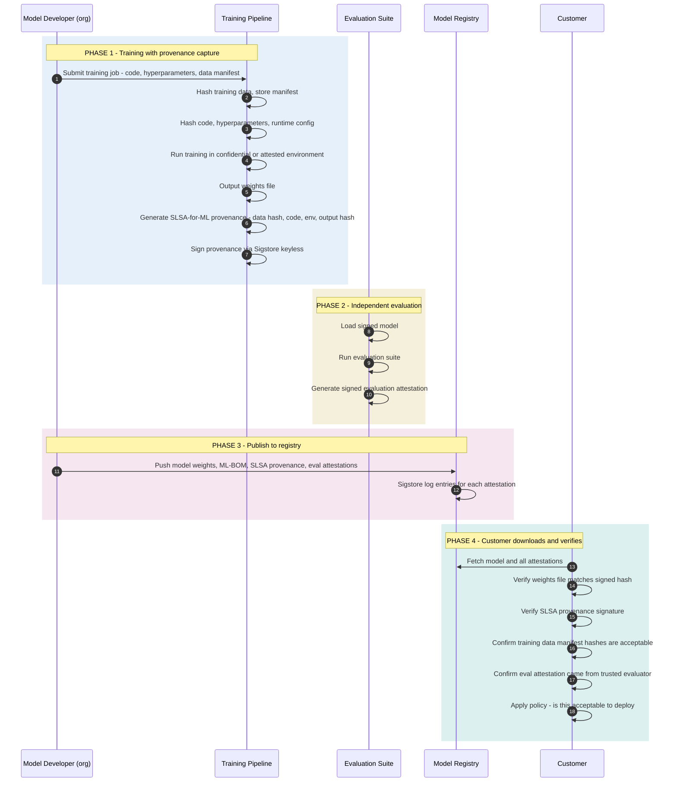

*Builds on: §7.1 SBOM, §7.2 SLSA.*

## The mental model

The software supply chain pattern — what's inside (SBOM), how it was built (SLSA), signed claims (in-toto), public log (Rekor) — has been the dominant integrity story for software for the past five years. AI models are software-shaped artifacts, but the existing tools fit imperfectly.

A frontier model is gigabytes of opaque tensor weights produced by a process no human directly inspected. SBOM for a model isn't quite the same as SBOM for a binary. SLSA provenance for a training run doesn't capture the data the model learned from. This is the active frontier of supply chain assurance.

## What needs to be attested about an AI model

| Artifact | Question being answered |
| --- | --- |
| Model weights file | Are these the actual weights from the claimed organization? |
| Training data | What data was used? Was anything copyrighted / sensitive included improperly? |
| Training run | What compute, what hyperparameters, what code was used? |
| Model card | What evaluations were run, what biases were measured? |
| Fine-tuning history | What downstream tuning has happened since base model release? |
| Inference environment | Is the deployed model actually the model the developer signed? |

## Emerging standards (still moving)

- **Model cards** (Mitchell et al., 2018; FAccT 2019) — structured documentation of model capabilities, limitations, and evaluations. Widely adopted in spirit (HuggingFace model cards, Anthropic/OpenAI system and model cards), though those are model-card-*style* documentation rather than the exact original schema.
- **ML-BOM** — CycloneDX extension for ML components. Lists training datasets, frameworks, weights, derivative models.
- **SLSA for ML** — proposed extensions to SLSA that capture training run provenance specifically (compute environment, hyperparameters, data manifests).
- **Sigstore for models** — Sigstore Model Signing project, signing model weight files with the same keyless infrastructure used for code.
- **zkML** — zero-knowledge proofs that a specific model performed a specific inference. Still research-stage but conceptually allows verifiable inference without revealing weights.

## The flow as it might look

## The hard problems still unsolved

- **Training data attestation** — proving "we trained only on data X" without revealing all of X is genuinely hard. ML-BOM lists datasets; it doesn't cryptographically prove what training actually saw.
- **Reproducibility** — same code + same data + same hardware should produce identical weights. In practice GPU nondeterminism, CUDA version, and random scheduling make this hard. SLSA L4 for ML is aspirational.
- **Inference integrity** — when you query a deployed model, how do you know the response came from the signed weights vs. a modified variant? Confidential computing helps; verifiable inference (zkML) is still research.
- **Fine-tuning provenance** — when a customer fine-tunes a base model, the resulting weights are downstream. The fine-tuning provenance needs to chain to the base model's provenance.

## Confidential computing and AI

NVIDIA's H100 introduced GPU-based confidential computing. The GPU runs in a TEE; the model weights and inputs are encrypted in GPU memory; an attestation proves the workload ran on genuine NVIDIA hardware with the expected firmware. This addresses inference-time integrity for customers running their own deployments.

This is one of the hottest areas in the field right now — bridging model provenance (SLSA-for-ML) with runtime attestation (confidential computing) to give end-to-end guarantees from training through deployment.

Where the field is heading

Expect the same pattern that consolidated for software (SBOM + SLSA + Sigstore + transparency log) to consolidate for AI models over the next 3-5 years. Anthropic, OpenAI, NVIDIA, Google, and academic groups are all pushing on this. Anyone building hardware-rooted security for AI infrastructure today is building the foundation for that consolidation.

Takeaway

The supply chain integrity model — describe contents, attest the build, sign claims, log publicly — extends to AI models but with new challenges around training data, reproducibility, and inference integrity. Confidential computing is increasingly the runtime complement to provenance.

