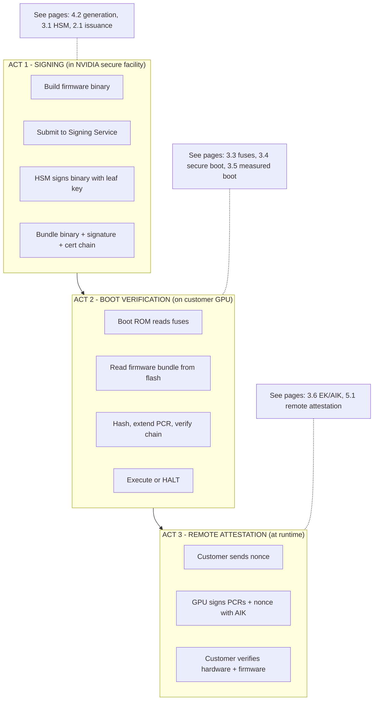
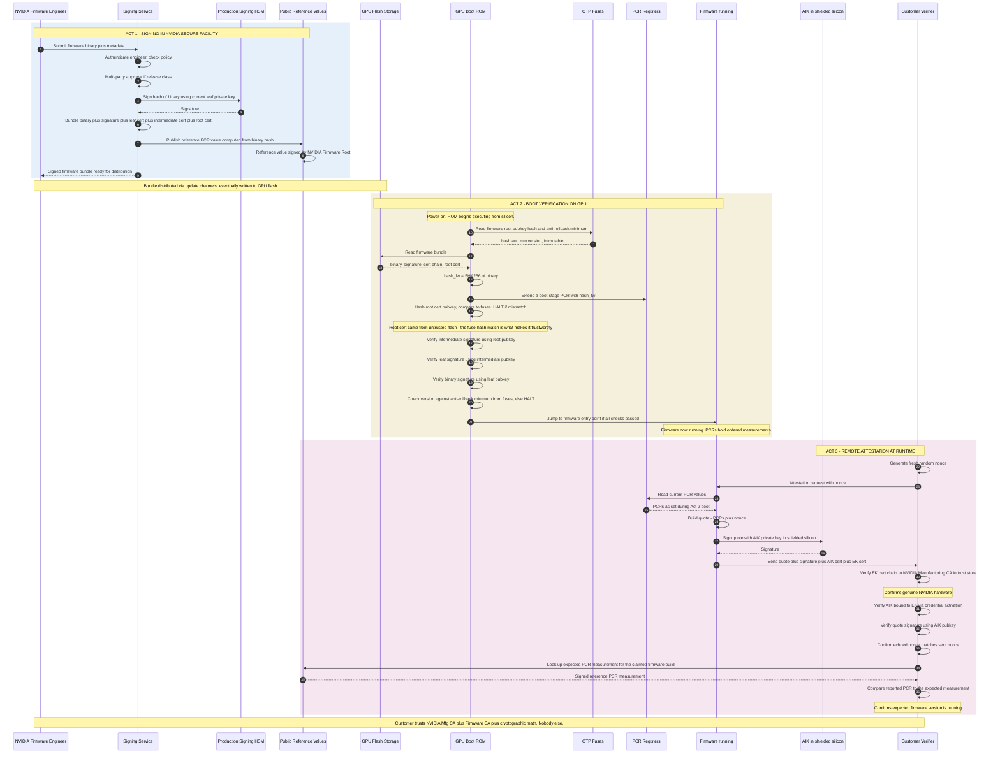

*Builds on: §3.4 Secure boot, §3.6 EK/AIK, §5.1 Remote attestation.*

## The mental model

Pieces of the firmware story have been covered in earlier sections — secure boot, measured boot, PCRs, attestation, key ceremonies. This page connects them end to end: from the moment a firmware binary is signed in a secure facility, through the boot verification on a customer's GPU, to the attestation a customer relies on at runtime.

The story has three acts, each backed by a different trust chain.

## The high-level shape

## Detailed sequence: signing, boot, attestation as one chain

## The trust chains in this story

| Chain | Anchor | What it proves | Used in |
| --- | --- | --- | --- |
| Firmware signing chain | Root pubkey hash in OTP fuses | Binary came from NVIDIA's signing service | Act 2 (boot) |
| Manufacturing identity chain | NVIDIA Manufacturing CA in customer's trust store | Hardware is a genuine NVIDIA chip | Act 3 (attestation) |
| Reference value chain | NVIDIA Firmware Root in customer's trust store | Expected PCR for this firmware version | Act 3 (attestation) |

Three separate trust chains, three separate roots, all rooted in NVIDIA but designed for different blast radii. Compromise of one doesn't compromise the others.

## What can go wrong, where

| Stage | Failure mode | Mitigation |
| --- | --- | --- |
| Signing | Insider produces unauthorized signing | M-of-N approval, audit logs, customer-side publish-time verification |
| Signing | HSM compromised, leaf key extracted | Short-lived leaf certs, intermediate revocation, fast rotation |
| Signing | Root key compromised | Catastrophic, recovery via backup root in fuses if designed in |
| Boot | Boot ROM exploit (e.g., checkm8 class) | Frozen at fabrication, cannot patch, mitigated by code minimalism |
| Boot | Downgrade to vulnerable firmware version | Anti-rollback minimum version fused at manufacturing |
| Attestation | EK extracted from chip | Side-channel resistant silicon, physical attack cost |
| Attestation | Trust store poisoning at customer | Hardware-rooted trust stores, signed updates, TOFU pinning |

Why three acts and not one

Signing happens once per release. Boot happens every power-cycle on every device. Attestation happens on demand from customers. Different cadences, different security boundaries, different trust questions. The architecture separates them so the operational tempo of one doesn't force compromises on the others.

Takeaway

Firmware lifecycle is three acts with three trust chains. The signing act produces a signed binary anchored in the firmware root. The boot act verifies offline using a hardware-anchored hash in fuses. The attestation act binds hardware identity and software state into one signed statement. Each act stands alone; together they give end-to-end trust.

