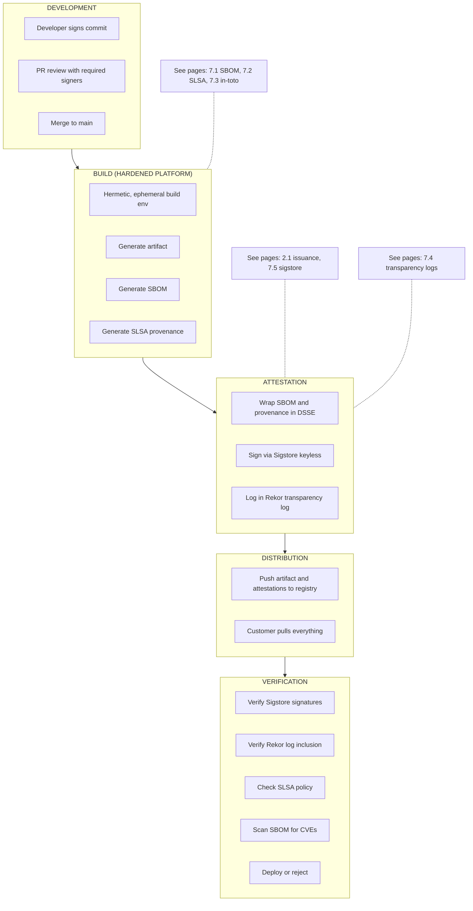
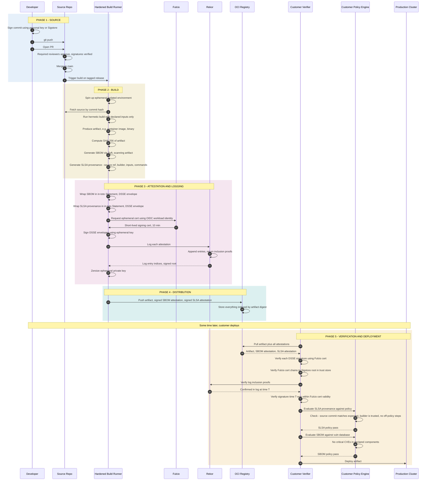

*Builds on: §7.2 SLSA, §7.3 in-toto, §7.5 Sigstore keyless.*

## The mental model

The pieces of modern supply chain assurance — SBOM, SLSA, in-toto, Sigstore, Rekor — were covered in section 7. Each is a focused tool. This page assembles them into a single end-to-end pipeline: a developer commits source, a build produces an artifact, attestations accumulate, and a downstream consumer verifies everything before deploying.

This is what a SLSA L3-or-better pipeline actually looks like in 2026.

## The high-level shape

## The end-to-end sequence

## What's being proven at the end

By the time the artifact reaches production, the customer has cryptographically verified:

- The artifact came from a specific source commit (SLSA provenance)
- The build ran on a hardened, isolated platform with no off-policy steps (SLSA provenance)
- The build was signed by an identity the customer trusts (Sigstore cert from Fulcio)
- The signature was logged publicly in Rekor (audit trail exists)
- The artifact's declared contents have no known critical vulnerabilities (SBOM scan)
- None of this evidence has been tampered with since publication (signatures + log inclusion proofs)

None of this requires trusting any intermediary (registry, network, CI vendor) — only the upstream signing identities and the public log.

## How this defends against real attacks

| Attack | What it tries to do | What blocks it |
| --- | --- | --- |
| Tampered binary in registry | Substitute malicious artifact under same name/tag | SHA-256 hash in provenance won't match; verification fails |
| SolarWinds-style build pipeline compromise | Inject malicious code during build | SLSA L3+ isolation + hermetic builds; provenance shows what actually ran |
| Stolen long-lived signing key | Sign arbitrary artifacts | No long-lived keys exist; identity is the only authority, monitored via Rekor |
| Dependency confusion attack | Slip malicious dependency into build | SBOM shows actual dependency, scan flags unexpected source |
| Backdated signature | Sign artifact, claim it was signed earlier | Rekor's signed-entry timestamp, cross-checked by log monitors (and optionally an independent RFC 3161 timestamp), establishes when signing happened — its trust depends on Rekor's auditability, not the bare timestamp |
| Unauthorized signature by valid identity | Compromise an OIDC account, sign things | Identity owner monitors Rekor, detects unexpected entries |

## What's still hard

Where the model is incomplete

Source-side compromise (developer's account / dev environment) still passes through this pipeline if the malicious code gets signed-committed. Branch protection, two-person review, and source-level signing help, but the chain is only as strong as its weakest link. The 2024 xz-utils / liblzma backdoor (CVE-2024-3094) — malicious code introduced upstream by a long-trusted maintainer — shows how source-side compromise slips past even strong build provenance.

Takeaway

Modern supply chain assurance is the composition of focused tools: SBOM for contents, SLSA for build integrity, in-toto for signed claims, Sigstore for keyless identity-based signing, Rekor for transparency. Together they give end-to-end cryptographic evidence from source to production, verifiable by any consumer without trusting any intermediary.

