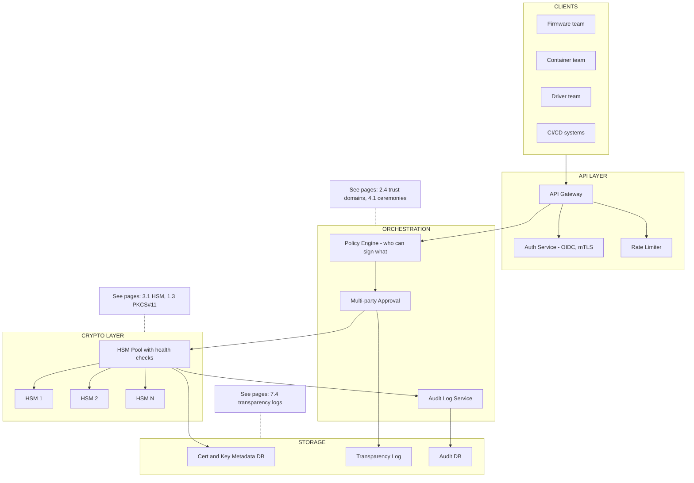
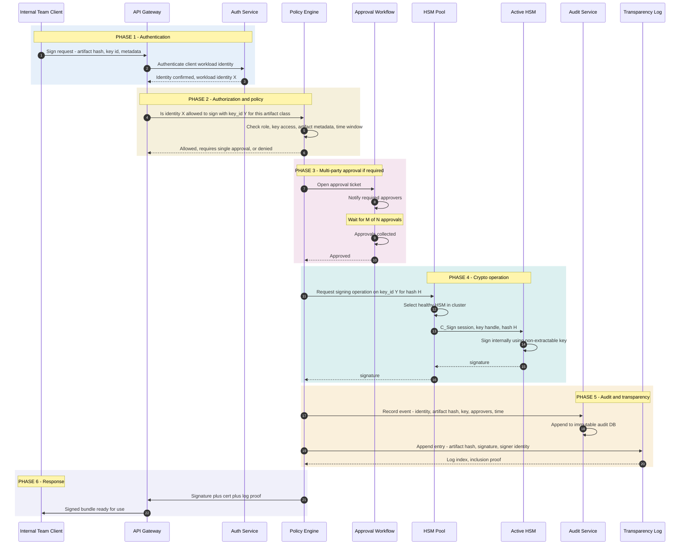

*Builds on: §3.1 HSM, §2.3 Key rotation, §4.1 Key ceremonies.*

## The mental model

A signing service is the platform layer that turns "raw HSM with keys in it" into "developer-facing API that any internal team can use to sign their artifacts." At a company the size of NVIDIA, every product line, every firmware team, every container team, every driver team needs to sign things. Each shouldn't roll their own HSM integration.

This page is the system design view: what would you build if you were designing this from scratch? What are the components, the boundaries, the failure modes, the scaling concerns?

## The high-level architecture

## The signing request lifecycle

## Design decisions and tradeoffs

### 1. Trust domain partitioning

The signing service is multi-tenant. Different internal teams need different keys with different policies. The natural partitioning is by **trust domain** — firmware signing keys, container signing keys, driver signing keys, etc. Each domain has its own intermediate CA, its own approval policies, its own audit stream.

This matches the principle from page 2.4 — one root per blast-radius boundary. A compromise of the container signing capability shouldn't affect firmware signing.

### 2. Key access at the HSM layer

HSMs themselves support multi-tenancy via partitions or roles. The signing service authenticates as a specific role for each operation, and PKCS#11 enforces which keys are accessible to which roles. The application layer's policy engine is a second line of defense; the HSM's own access control is the first.

### 3. HSM pool and failover

Single HSMs are SPOFs. Production deployments cluster:

- Multiple HSMs hold the same keys via vendor-specific cloning
- Health monitoring routes traffic away from failing HSMs
- Cluster spans availability zones / regions for disaster resilience
- Key cloning happens hardware-to-hardware over encrypted channels (no plaintext key material ever leaves the HSM boundary)

### 4. Approval workflow integration

For high-value keys, signing requires multi-party approval. The approval workflow can be:

- **Synchronous** — request blocks until approvers act. Suited to release ceremonies.
- **Asynchronous** — request queued, notified when approved, client polls. Suited to high-volume signing.
- **Standing approval** — pre-approved for a class of artifacts within policy. Used for routine CI signing within strict parameters.

### 5. Caching and freshness

Most signing involves signing the same kinds of things over and over. The service can cache:

- Policy decisions (with short TTL, conservatively invalidated)
- Issued certs (for re-issuance scenarios)
- Workload identity lookups

The signature itself never caches — every request produces a fresh signature with a unique timestamp / nonce.

### 6. Audit log integrity

The audit log is high-value evidence. It should be:

- Append-only (append-only DB, write-once storage, or Merkle-log structured)
- Replicated across availability zones
- Periodically attested by a separate process (cron job that signs the current state)
- Independently queryable by compliance teams without going through the signing service itself

### 7. Observability and rate limiting

Production signing services need:

- Per-tenant rate limits (no team can DoS the HSM pool)
- Anomaly detection ("this team usually signs 100 things per day, today they're signing 100,000")
- Latency tracking per HSM (early warning of HSM degradation)
- Cost attribution (HSM operations cost real money; track per-team)

## Capacity planning

| Metric | Typical magnitude | Constraint |
| --- | --- | --- |
| RSA-4096 signings per HSM per second | ~50-500 (4096-bit is several times slower than 2048-bit; ~1000+/s is RSA-2048 territory) | HSM coprocessor throughput |
| ECDSA P-256 signings per HSM per second | ~5000-20000 | Fast key type, less constrained |
| Concurrent signing sessions per HSM | ~100-1000 | Session table size |
| Network HSM latency | ~5-50 ms per operation | Mostly network round trip |
| PCIe HSM latency | ~0.1-1 ms per operation | Bus + crypto compute |

The capacity ceiling is usually crypto throughput on RSA-heavy workloads, but session limits and network latency dominate for routine operations.

## How the principles from earlier sections apply

| From section | Applies here as |
| --- | --- |
| 1.2 Key hierarchy | Service-issued ephemeral keys are wrapped under master KEKs in HSMs |
| 1.3 PKCS#11 | The HSM pool speaks PKCS#11; service abstracts it from clients |
| 2.3 Key rotation | Service implements overlapping cert validity; old leaves remain valid during transition |
| 2.4 Trust domains | Service partitions by domain; each has separate intermediate |
| 4.1 Ceremonies | High-value root operations escalate to formal ceremonies outside the routine API |
| 7.5 Sigstore | For some use cases (ephemeral signing, OSS releases), service can mediate Sigstore flows |
| 7.4 Transparency logs | Service can append every signature to internal transparency log for audit |

The platform mindset

The hardest part of this design isn't the cryptography — it's the platform engineering. Multi-tenancy, capacity planning, observability, policy expression, approval workflows, audit integration. The crypto layer is the smallest and most well-understood part. Most signing service failures in practice are operational, not cryptographic.

Takeaway

A signing service is what turns 'we have HSMs with keys in them' into 'every product team can sign artifacts via a stable API.' The crypto layer is the foundation; the operational layer — policy, approval, audit, multi-tenancy — is where the real engineering happens. Done well, it makes the right thing easy and the wrong thing impossible.

